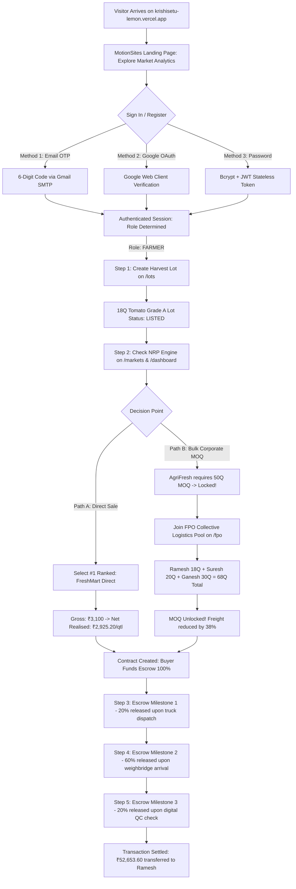
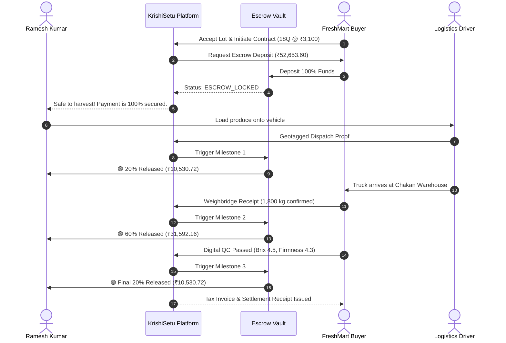
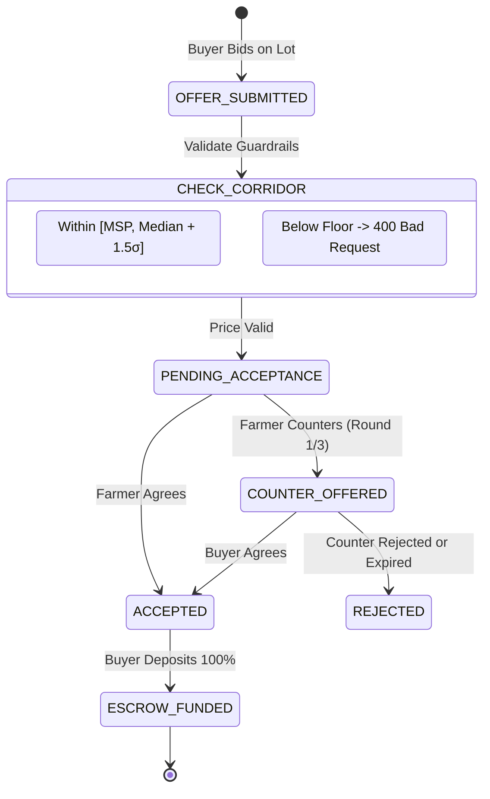

# KrishiSetu (कृषिसेतु) — End-to-End Website & System Architecture Guide

> **A Complete, Step-by-Step Breakdown of How KrishiSetu Operates from Visitor to Final Settlement**  
> *Smart India Hackathon 2026 • Problem Statement SIH26132 • Team HackOps*  
> **Live Production:** [https://krishisetu-lemon.vercel.app](https://krishisetu-lemon.vercel.app) • **Live Demo/Staging:** [https://krishisetu-demo.vercel.app](https://krishisetu-demo.vercel.app)

---

## 🧭 Table of Contents
1. [Platform Overview & Core Mission](#1-platform-overview--core-mission)
2. [User Personas & System Roles](#2-user-personas--system-roles)
3. [Master End-to-End Flow Diagram](#3-master-end-to-end-flow-diagram)
4. [Detailed Step-by-Step User Journeys](#4-detailed-step-by-step-user-journeys)
   - [Step 1: Discovery & Cinematic Landing Page (`/`)](#step-1-discovery--cinematic-landing-page-)
   - [Step 2: Unified 3-in-1 Authentication (`AuthModal`)](#step-2-unified-3-in-1-authentication-authmodal)
   - [Step 3: Harvest Lot Creation & Verification (`/lots`)](#step-3-harvest-lot-creation--verification-lots)
   - [Step 4: Market Intelligence & Net Realised Price Engine (`/markets`)](#step-4-market-intelligence--net-realised-price-engine-markets)
   - [Step 5: Farmer Command Center & Decision Card (`/dashboard`)](#step-5-farmer-command-center--decision-card-dashboard)
   - [Step 6: FPO Collective Logistics Pooling (`/fpo`)](#step-6-fpo-collective-logistics-pooling-fpo)
   - [Step 7: Corporate Buyer Procurement & Counter-Offers (`/buyer`)](#step-7-corporate-buyer-procurement--counter-offers-buyer)
   - [Step 8: Milestone Escrow Vault & Settlement (`/transactions`)](#step-8-milestone-escrow-vault--settlement-transactions)
   - [Step 9: Administrative Governance & Audit Logs (`/admin/users`)](#step-9-administrative-governance--audit-logs-adminusers)
5. [The 7 Mathematical Domain Engines](#5-the-7-mathematical-domain-engines)
6. [Detailed Flowcharts & Sequence Diagrams](#6-detailed-flowcharts--sequence-diagrams)
7. [Technology Stack & File Architecture](#7-technology-stack--file-architecture)
8. [Failure Modes, Security & Resilience](#8-failure-modes-security--resilience)

---

## 1. Platform Overview & Core Mission

Indian agriculture suffers from severe **price information asymmetry**. Farmers travel to distant Agricultural Produce Market Committees (APMCs) based purely on high advertised headline rates (e.g. ₹3,050/quintal at Pune APMC vs ₹2,800/quintal at local Talegaon), only to discover upon arrival that after deducting diesel transportation, APMC mandi cess, loading/unloading fees, and in-transit bruising, their **actual take-home earnings are significantly lower**.

Furthermore, individual smallholder farmers are blocked from selling directly to high-paying food processors and supermarket chains because they cannot meet institutional **Minimum Order Quantities (MOQs)** like 50 Quintals.

### What KrishiSetu Does:
1. **Shifts Focus to Net Realised Price (NRP):** Shows farmers the exact take-home cash left in hand across all nearby traditional mandis and verified direct buyers.
2. **Aggregates Smallholder Harvests (FPO Pooling):** Clusters fragmented lots into unified bulk contracts, unlocking corporate buyer MOQs and slashing transportation costs by up to 38%.
3. **Guarantees Fair Trade & Payments:** Enforces algorithmic counter-offer bounds to prevent distress lowballing, backed by a 3-stage smart milestone escrow vault.

---

## 2. User Personas & System Roles

| Persona | Role Key | Real-World Persona | Primary Goals | Key Routes |
|---|---|---|---|---|
| **Farmer** | `FARMER` | **Ramesh Kumar**, Talegaon (18Q Tomato harvest) | Find highest take-home profit, list harvests, track payments | `/`, `/dashboard`, `/markets`, `/lots`, `/fpo`, `/transactions` |
| **FPO Admin** | `FPO_ADMIN` | **Kailash Joshi**, Talegaon Kisan Co-op | Pool member volumes, negotiate bulk contracts, assign trucks | `/fpo`, `/markets`, `/transactions` |
| **Corporate Buyer** | `BUYER` | **FreshMart / AgriFresh**, Chakan Industrial Area | Procure verified Grade A produce, post demand, track shipments | `/buyer`, `/transactions` |
| **Transporter** | `TRANSPORTER` | Verified Logistics Provider | Accept dispatch bookings, provide GPS weighbridge receipts | `/transactions` |
| **System Admin** | `ADMIN` | Platform Operator / Auditor | Manage roles, inspect dispute evidence, view audit logs | `/admin/users` |
| **Guest** | `GUEST` | Unauthenticated Farmer/Visitor | Explore public market prices and test canonical scenario | `/`, `/markets` (preview mode) |

---

## 3. Master End-to-End Flow Diagram



---

## 4. Detailed Step-by-Step User Journeys

---

### Step 1: Discovery & Cinematic Landing Page (`/`)
- **URL:** [`https://krishisetu-lemon.vercel.app/`](https://krishisetu-lemon.vercel.app/)
- **Visual Design:** MotionSites cinematic layout featuring warm emerald glassmorphism (`#061a14`), live animated metrics counters, and responsive fluid layouts.
- **Interactive Features:**
  - **Live Scenario Slider:** Visitors can explore Ramesh Kumar's 18 Quintal harvest live without signing in.
  - **The 7 Engines Showcase:** Tabbed interactive cards detailing each calculation module.
  - **Convix Navbar:** Sticky glass header with live platform status badges, quick links, and dynamic User/Guest indicators.

---

### Step 2: Unified 3-in-1 Authentication (`AuthModal`)
- **Trigger:** Clicking **"Sign In / OTP"** in the navigation header.
- **React Portal Architecture:** The modal is rendered via `createPortal(modalJSX, document.body)`. This guarantees the dialog floats over the entire viewport on Windows and mobile devices, bypassing CSS containing-block constraints caused by `backdrop-filter: blur-md` in headers.
- **Three Authentication Modes:**
  1. **Passwordless Email OTP (Built for Farmers):**
     - Farmer enters email $\rightarrow$ NestJS generates 6-digit cryptographically secure OTP with a 10-minute TTL.
     - Delivered instantly via enterprise Gmail SMTP transport.
     - Farmer submits OTP $\rightarrow$ Backend validates $\rightarrow$ Issues signed JWT.
  2. **Google OAuth 2.0 (Built for Buyers):**
     - One-click sign-in using Google Identity Services.
     - Backend verifies Google's token signature via `OAuth2Client.verifyIdToken`.
  3. **Standard Password & JWT:**
     - 10-round Bcrypt password hashing for enterprise administrators.

---

### Step 3: Harvest Lot Creation & Verification (`/lots`)
- **URL:** [`https://krishisetu-lemon.vercel.app/lots`](https://krishisetu-lemon.vercel.app/lots)
- **User Action:** The farmer enters harvest parameters:
  - **Crop & Variety:** Tomato (Hybrid Vaishali / S-227)
  - **Harvest Volume:** 18 Quintals (1,800 kg)
  - **Harvest Date:** Verified date (e.g. Sep 6, 2026)
  - **Origin Location:** Dehu Road Cluster, Talegaon / Haveli, Pune
  - **Quality Parameters:** Grade A (Firmness $> 4.2\text{ kg/cm}^2$, Color Index 85% red ripe, Defects $< 2\%$)
- **Backend Validation:** Lot is saved in PostgreSQL via Prisma with status `LISTED`.

---

### Step 4: Market Intelligence & Net Realised Price Engine (`/markets`)
- **URL:** [`https://krishisetu-lemon.vercel.app/markets`](https://krishisetu-lemon.vercel.app/markets)
- **The Core Calculation:** The platform compares all 7 market channels in real time:

$$\text{Net Realised Price (NRP)} = \text{Gross Price} - \text{Freight} - \text{Mandi Cess} - \text{Handling/Hamali} - \text{Spoilage Degradation}$$

#### The Official 7-Channel Comparison Matrix:
| Rank | Market Channel | Type | Distance | Gross Rate | Freight/Qtl | Mandi Cess | Spoilage | Final NRP | Total Realised (18Q) | Status |
|:---:|---|---|:---:|:---:|:---:|:---:|:---:|:---:|:---:|:---:|
| 🥇 **#1** | **FreshMart Foods** | Direct Corporate | 12 km | **₹3,100** | ₹120.00 | ₹0.00 | ₹54.80 | **₹2,925.20** | **₹52,653.60** | **RECOMMENDED** |
| 🥈 **#2** | **Pune APMC** | Distant Mandi | 45 km | **₹3,050** | ₹180.00 | ₹45.75 | ₹37.25 | **₹2,787.00** | **₹50,166.00** | -₹2,487.60 Loss |
| 🥉 **#3** | **Pimpri APMC** | Medium Mandi | 28 km | **₹2,850** | ₹135.00 | ₹42.75 | ₹16.25 | **₹2,656.00** | **₹47,808.00** | -₹4,845.60 Loss |
| 4 | **Talegaon APMC** | Local Mandi | 8 km | **₹2,800** | ₹130.00 | ₹42.00 | ₹6.00 | **₹2,622.00** | **₹47,196.00** | -₹5,457.60 Loss |
| 5 | **AgriFresh Corporate** | Bulk Processor | 35 km | **₹3,200** | ₹140.00 | ₹0.00 | ₹28.00 | **₹3,032.00** | *Ineligible* | Requires 50Q MOQ |
| 6 | **Kisan Mandi Hub** | Private Yard | 20 km | **₹2,750** | ₹125.00 | ₹27.50 | ₹14.00 | **₹2,583.50** | **₹46,503.00** | Lower Net |
| 7 | **Local Aggregator** | Village Middleman| 2 km | **₹2,400** | ₹40.00 | ₹0.00 | ₹2.00 | **₹2,358.00** | **₹42,444.00** | Distressed Sale |

> **Key Insight:** While Pune APMC advertises ₹3,050 (which seems higher than Talegaon's ₹2,800), its heavy transit costs and mandi cess reduce take-home earnings to ₹2,787. FreshMart direct selling yields **₹2,925.20/qtl**, earning Ramesh **₹2,487.60 more profit today**.

---

### Step 5: Farmer Command Center & Decision Card (`/dashboard`)
- **URL:** [`https://krishisetu-lemon.vercel.app/dashboard`](https://krishisetu-lemon.vercel.app/dashboard)
- **Farmer Experience:** Instead of drowning in raw data tables, the dashboard displays:
  - **"What should I do today, Ramesh?"**: A high-impact hero card spotlighting FreshMart as the #1 algorithmic opportunity.
  - **One-Tap Actions:** Direct buttons to *"Sell 18Q to FreshMart"*, *"View Cost Breakdown"*, or *"Join FPO Pool"*.
  - **Interactive Sliders:** Live freight distance and market price tweak controls to see real-time sensitivity analysis.

---

### Step 6: FPO Collective Logistics Pooling (`/fpo`)
- **URL:** [`https://krishisetu-lemon.vercel.app/fpo`](https://krishisetu-lemon.vercel.app/fpo)
- **The Problem:** AgriFresh Corporate offers ₹3,200/qtl (NRP ₹3,032), but enforces a **50 Quintal Minimum Order Quantity (MOQ)**. Ramesh's 18 Quintals cannot qualify alone.
- **The Aggregation Solution:**
  1. The aggregation engine clusters active lots within a 15 km radius:
     - Ramesh Kumar: 18 Quintals
     - Suresh Patil: 20 Quintals
     - Ganesh Shinde: 30 Quintals
     - **Total Pooled Volume:** **68 Quintals** ($\ge 50$ Qtl MOQ unlocked!)
  2. **Shared Logistics Savings:** Replacing 3 independent pickup trips with a single 10-ton commercial truck reduces freight from ₹120/qtl to ₹74.40/qtl (**38% savings**).

---

### Step 7: Corporate Buyer Procurement & Counter-Offers (`/buyer`)
- **URL:** [`https://krishisetu-lemon.vercel.app/buyer`](https://krishisetu-lemon.vercel.app/buyer)
- **Buyer Experience:** Supermarkets and food processors post institutional demand with quality standards and delivery deadlines.
- **Bilateral Counter-Offer Corridor:**
  - If a buyer attempts to lowball below the fair market boundary:
    $$\text{Price}_{\min} = \max(\text{MSP}, \text{Market Median} - 1.5 \times \sigma)$$
  - The backend `ValidationPipe` and `OffersService` mathematically reject the bid with `400 Bad Request: Predatory Pricing Guardrail Violation`.
  - Negotiations are limited to 3 rounds to avoid perishable crop spoilage.

---

### Step 8: Milestone Escrow Vault & Settlement (`/transactions`)
- **URL:** [`https://krishisetu-lemon.vercel.app/transactions`](https://krishisetu-lemon.vercel.app/transactions)
- **100% Pre-Funded Protection:** The buyer deposits 100% of order value (₹52,653.60) into the smart escrow vault before harvesting begins.
- **3-Stage Release Lifecycle:**
  1. **Milestone 1 (20% = ₹10,530.72):** Released to farmer upon verified truck loading and driver dispatch confirmation.
  2. **Milestone 2 (60% = ₹31,592.16):** Released when the truck arrives at the buyer's gate and weighbridge tickets verify gross weight (1,800 kg).
  3. **Milestone 3 (20% = ₹10,530.72):** Released upon digital quality inspection (QC).
- **Dispute Resolution Matrix:** If a delivery has 5% minor blemishes, the dispute engine calculates an automated pro-rata price adjustment (e.g. ₹540 deduction) instead of allowing the buyer to cancel the entire ₹52,000 order.

---

### Step 9: Administrative Governance & Audit Logs (`/admin/users`)
- **URL:** [`https://krishisetu-lemon.vercel.app/admin/users`](https://krishisetu-lemon.vercel.app/admin/users)
- **Governance Controls:** System administrators can inspect user accounts, verify FPO certifications, promote roles (`FARMER` $\rightarrow$ `FPO_ADMIN`), and view immutable audit trail logs of all privileged operations.

---

## 5. The 7 Mathematical Domain Engines

All 7 engines reside in `packages/shared/src/engines/` and execute as the **Single Source of Truth** across both Next.js frontend and NestJS backend:

1. **`nrp-engine.ts` (Net Realised Price):**
   Factors gross price, distance-based freight, mandi cess, loading fees, and transit decay.
2. **`quality.engine.ts` (Spoilage & Quality Degradation):**
   Calculates exponential decay based on temperature and transit hours:
   $$\text{Loss} = \text{Gross} \times \left(1 - e^{-k \cdot t \cdot (T / T_{\text{base}})}\right)$$
3. **`aggregation-engine.ts` (Harvest Clustering):**
   Geospatially groups smallholder lots within a radius buffer to satisfy buyer MOQs.
4. **`logistics-engine.ts` (Freight & Capacity Optimization):**
   Computes dynamic truck rates per km and consolidates vehicle fill ratios.
5. **`buyer-matching-engine.ts` (Demand-Supply Pairing):**
   Matches corporate procurement criteria with graded harvest lots.
6. **`ranking-engine.ts` (Multi-Attribute Channel Ranking):**
   Sorts channels by NRP, payment security, distance, and buyer trust score.
7. **`trust-engine.ts` & `escrow.engine.ts` (Milestone Vault & Governance):**
   Enforces 20/60/20 escrow milestones and manages buyer trust scores.

---

## 6. Detailed Flowcharts & Sequence Diagrams

### Complete Escrow Settlement Sequence Diagram


### Bilateral Counter-Offer State Machine


---

## 7. Technology Stack & File Architecture

```
KrishiSetu/
├── apps/
│   ├── web/                              # Next.js 14 Frontend
│   │   ├── src/app/page.tsx              # MotionSites Cinematic Landing Page
│   │   ├── src/app/dashboard/page.tsx    # Farmer Command Center
│   │   ├── src/app/markets/page.tsx      # 7-Channel Market Intelligence
│   │   ├── src/app/lots/page.tsx         # Harvest Lot Management
│   │   ├── src/app/fpo/page.tsx          # FPO Logistics Pooling
│   │   ├── src/app/buyer/page.tsx        # Corporate Buyer Portal
│   │   ├── src/app/transactions/page.tsx # Escrow Tracking & Slips
│   │   ├── src/app/admin/users/page.tsx  # Admin User Governance
│   │   ├── src/components/AuthModal.tsx  # React Portal 3-in-1 Auth Dialog
│   │   └── src/components/ConvixNavbar.tsx # Dynamic Navbar with Guest/User Badges
│   └── api/                              # NestJS 10 Backend
│       ├── src/auth/                     # OTP, Google OAuth & JWT Strategies
│       ├── src/email/                    # Nodemailer Gmail SMTP Service
│       ├── src/lots/                     # Harvest Lot Controllers & Services
│       ├── src/offers/                   # Counter-Offer Negotiation Service
│       ├── src/transactions/             # Escrow Milestone Lifecycle
│       ├── src/prisma/schema.prisma      # PostgreSQL Relational Schema
│       └── src/main.ts                   # Bootstrap & Validation Pipes
├── packages/
│   └── shared/                           # Single Source of Truth
│       └── src/engines/                  # 7 Mathematical Domain Engines
└── docs/                                 # Complete Documentation
    ├── README.md                         # This Master Architectural Guide
    ├── ARCHITECTURE.md                   # System Architecture Deep Dive
    ├── DEMO.md                           # Live Evaluator Presentation Script
    ├── TEAM.md                           # Team HackOps Roster & Ownership
    └── members/                          # 6 Individual Study Guides
```

---

## 8. Failure Modes, Security & Resilience

| Potential Failure Point | Platform Defense Mechanism |
|---|---|
| **Pasted SMTP Password with Spaces** | `email.service.ts` automatically strips whitespace via `.replace(/\s+/g, '')`. |
| **Google SMTP Network Timeout** | Automated fallback logging outputs the 6-digit OTP directly to terminal console for live demo resilience. |
| **Modal Clipping on Windows** | `createPortal(modalJSX, document.body)` bypasses header CSS `backdrop-filter: blur` containing block constraints. |
| **Price Tampering via Postman** | NestJS `ValidationPipe` whitelist filtering and server-authoritative price corridor mathematical validation. |
| **Double-Selling Concurrency** | `prisma.$transaction` locks harvest lot records atomically during buyer offer acceptance. |
| **Buyer Reneging or Non-Payment** | Harvest instructions are only released after 100% of order value is locked in the neutral Escrow vault. |
| **Perishable Produce Rejection** | Automated 4-hour inspection timeout and pro-rata defect deduction matrix prevent arbitrary load rejection. |

---

*Authored by **Team HackOps** for the Smart India Hackathon (SIH 2026).*  
*Repository:* [https://github.com/HackOpsIndia/KrishiSetu](https://github.com/HackOpsIndia/KrishiSetu)
