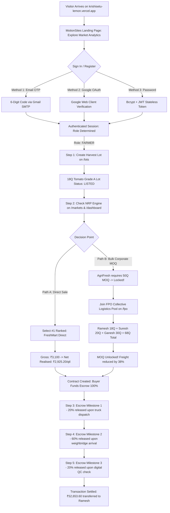
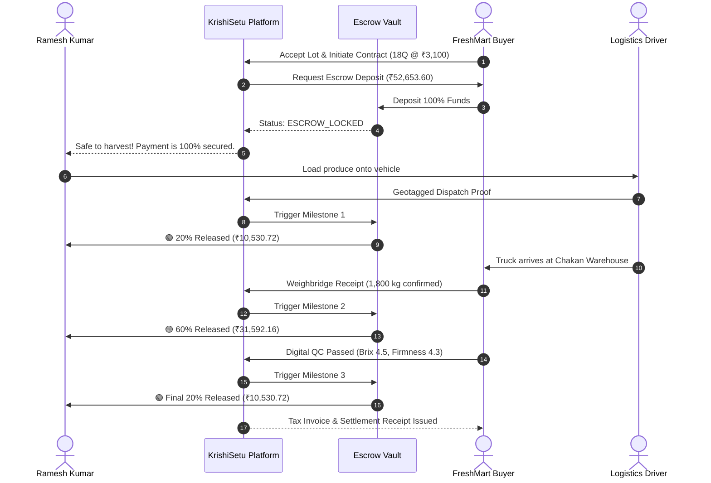
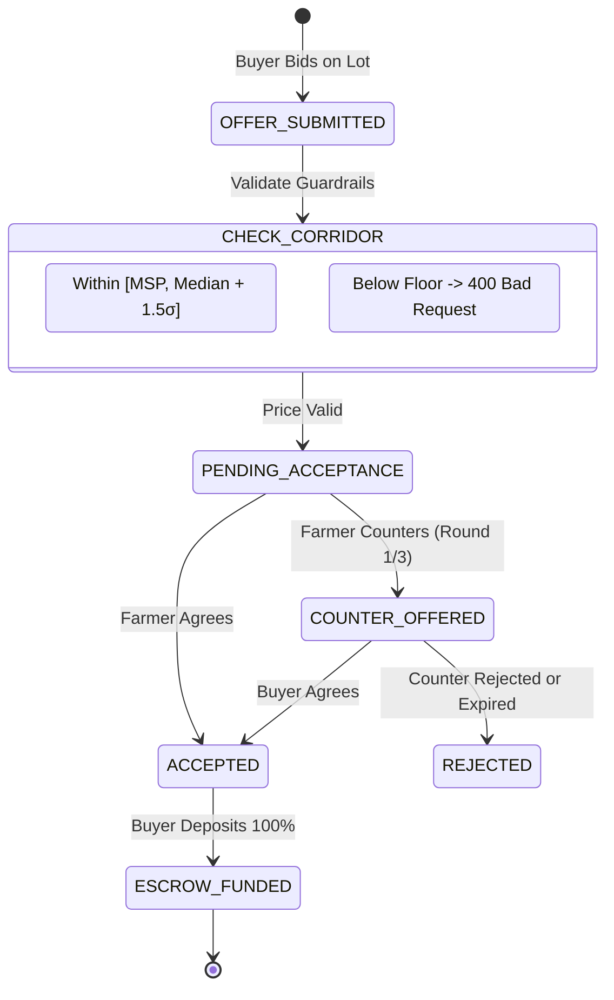
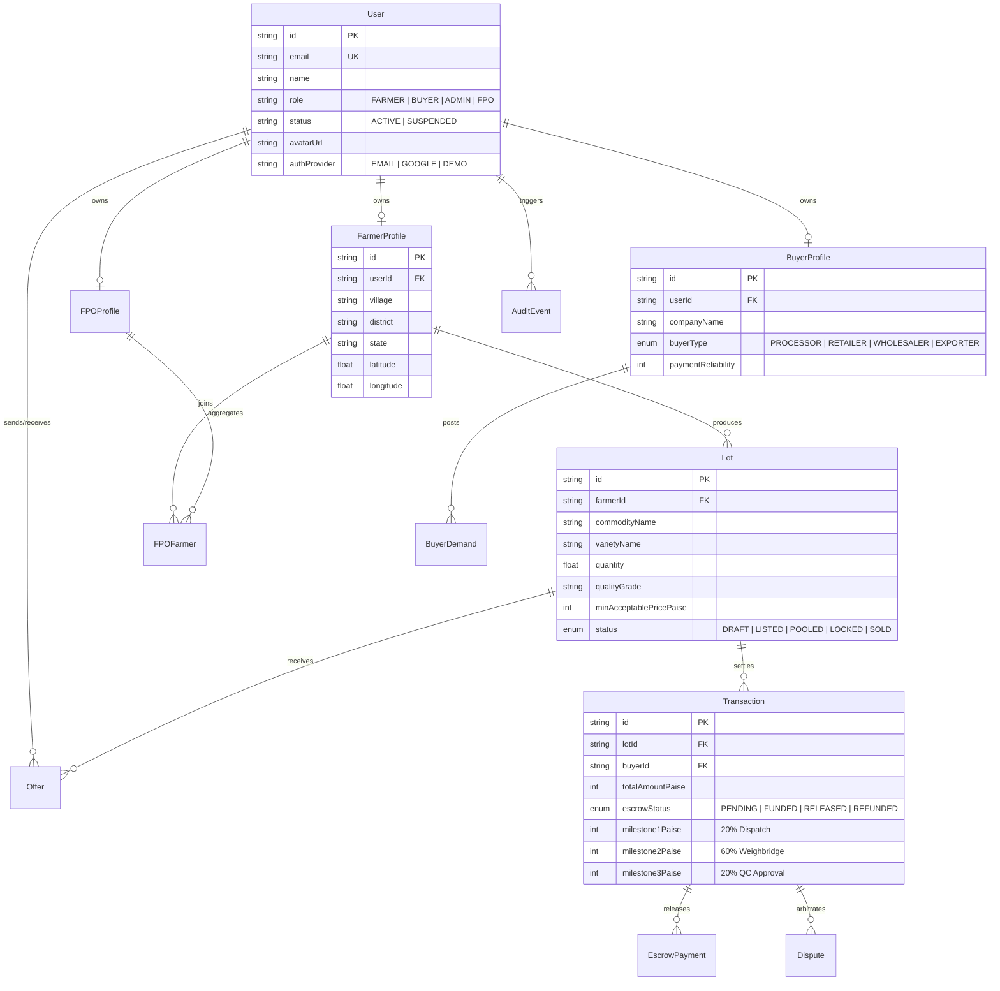
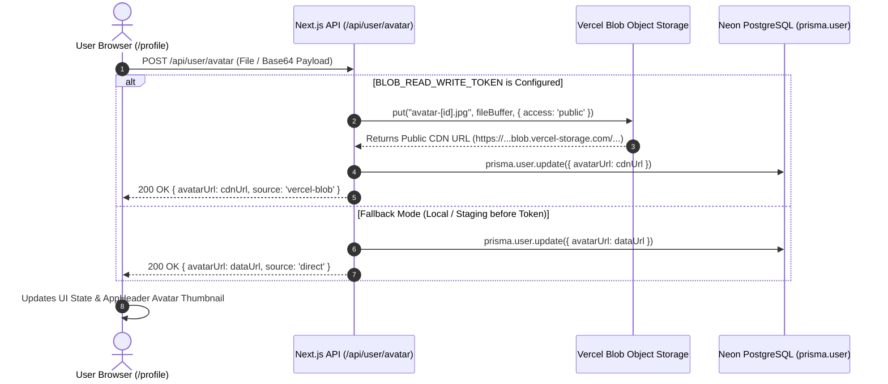

# KrishiSetu (कृषिसेतु) — End-to-End Website & System Architecture Guide

> **A Complete, Step-by-Step Breakdown of How KrishiSetu Operates from Visitor to Final Settlement**  
> *Smart India Hackathon 2026 • Problem Statement SIH26132 • Team HackOps*  
> **Live Production:** [https://krishisetu-lemon.vercel.app](https://krishisetu-lemon.vercel.app) • **Live Demo/Staging:** [https://krishisetu-demo.vercel.app](https://krishisetu-demo.vercel.app)

---

## 🧭 Table of Contents
1. [Platform Overview & Core Mission](#1-platform-overview--core-mission)
2. [User Personas & System Roles](#2-user-personas--system-roles)
3. [Master End-to-End Flow Diagram](#3-master-end-to-end-flow-diagram)
4. [Detailed Step-by-Step User Journeys](#4-detailed-step-by-step-user-journeys)
   - [Step 1: Discovery & Cinematic Landing Page (`/`)](#step-1-discovery--cinematic-landing-page-)
   - [Step 2: Unified 3-in-1 Authentication (`AuthModal`)](#step-2-unified-3-in-1-authentication-authmodal)
   - [Step 3: Harvest Lot Creation & Verification (`/lots`)](#step-3-harvest-lot-creation--verification-lots)
   - [Step 4: Market Intelligence & Net Realised Price Engine (`/markets`)](#step-4-market-intelligence--net-realised-price-engine-markets)
   - [Step 5: Farmer Command Center & Decision Card (`/dashboard`)](#step-5-farmer-command-center--decision-card-dashboard)
   - [Step 6: FPO Collective Logistics Pooling (`/fpo`)](#step-6-fpo-collective-logistics-pooling-fpo)
   - [Step 7: Corporate Buyer Procurement & Counter-Offers (`/buyer`)](#step-7-corporate-buyer-procurement--counter-offers-buyer)
   - [Step 8: Milestone Escrow Vault & Settlement (`/transactions`)](#step-8-milestone-escrow-vault--settlement-transactions)
   - [Step 9: Administrative Governance & Audit Logs (`/admin/users`)](#step-9-administrative-governance--audit-logs-adminusers)
5. [The 7 Mathematical Domain Engines](#5-the-7-mathematical-domain-engines)
6. [Detailed Flowcharts & Sequence Diagrams](#6-detailed-flowcharts--sequence-diagrams)
7. [Technology Stack & File Architecture](#7-technology-stack--file-architecture)
8. [Failure Modes, Security & Resilience](#8-failure-modes-security--resilience)

---

## 1. Platform Overview & Core Mission

Indian agriculture suffers from severe **price information asymmetry**. Farmers travel to distant Agricultural Produce Market Committees (APMCs) based purely on high advertised headline rates (e.g. ₹3,050/quintal at Pune APMC vs ₹2,800/quintal at local Talegaon), only to discover upon arrival that after deducting diesel transportation, APMC mandi cess, loading/unloading fees, and in-transit bruising, their **actual take-home earnings are significantly lower**.

Furthermore, individual smallholder farmers are blocked from selling directly to high-paying food processors and supermarket chains because they cannot meet institutional **Minimum Order Quantities (MOQs)** like 50 Quintals.

### What KrishiSetu Does:
1. **Shifts Focus to Net Realised Price (NRP):** Shows farmers the exact take-home cash left in hand across all nearby traditional mandis and verified direct buyers.
2. **Aggregates Smallholder Harvests (FPO Pooling):** Clusters fragmented lots into unified bulk contracts, unlocking corporate buyer MOQs and slashing transportation costs by up to 38%.
3. **Guarantees Fair Trade & Payments:** Enforces algorithmic counter-offer bounds to prevent distress lowballing, backed by a 3-stage smart milestone escrow vault.

---

## 2. User Personas & System Roles

| Persona | Role Key | Real-World Persona | Primary Goals | Key Routes |
|---|---|---|---|---|
| **Farmer** | `FARMER` | **Ramesh Kumar**, Talegaon (18Q Tomato harvest) | Find highest take-home profit, list harvests, track payments | `/`, `/dashboard`, `/markets`, `/lots`, `/fpo`, `/transactions` |
| **FPO Admin** | `FPO_ADMIN` | **Kailash Joshi**, Talegaon Kisan Co-op | Pool member volumes, negotiate bulk contracts, assign trucks | `/fpo`, `/markets`, `/transactions` |
| **Corporate Buyer** | `BUYER` | **FreshMart / AgriFresh**, Chakan Industrial Area | Procure verified Grade A produce, post demand, track shipments | `/buyer`, `/transactions` |
| **Transporter** | `TRANSPORTER` | Verified Logistics Provider | Accept dispatch bookings, provide GPS weighbridge receipts | `/transactions` |
| **System Admin** | `ADMIN` | Platform Operator / Auditor | Manage roles, inspect dispute evidence, view audit logs | `/admin/users` |
| **Guest** | `GUEST` | Unauthenticated Farmer/Visitor | Explore public market prices and test canonical scenario | `/`, `/markets` (preview mode) |

---

## 3. Master End-to-End Flow Diagram



---

## 4. Detailed Step-by-Step User Journeys

---

### Step 1: Discovery & Cinematic Landing Page (`/`)
- **URL:** [`https://krishisetu-lemon.vercel.app/`](https://krishisetu-lemon.vercel.app/)
- **Visual Design:** MotionSites cinematic layout featuring warm emerald glassmorphism (`#061a14`), live animated metrics counters, and responsive fluid layouts.
- **Interactive Features:**
  - **Live Scenario Slider:** Visitors can explore Ramesh Kumar's 18 Quintal harvest live without signing in.
  - **The 7 Engines Showcase:** Tabbed interactive cards detailing each calculation module.
  - **Convix Navbar:** Sticky glass header with live platform status badges, quick links, and dynamic User/Guest indicators.

---

### Step 2: Unified 3-in-1 Authentication (`AuthModal`)
- **Trigger:** Clicking **"Sign In / OTP"** in the navigation header.
- **React Portal Architecture:** The modal is rendered via `createPortal(modalJSX, document.body)`. This guarantees the dialog floats over the entire viewport on Windows and mobile devices, bypassing CSS containing-block constraints caused by `backdrop-filter: blur-md` in headers.
- **Three Authentication Modes:**
  1. **Passwordless Email OTP (Built for Farmers):**
     - Farmer enters email $\rightarrow$ NestJS generates 6-digit cryptographically secure OTP with a 10-minute TTL.
     - Delivered instantly via enterprise Gmail SMTP transport.
     - Farmer submits OTP $\rightarrow$ Backend validates $\rightarrow$ Issues signed JWT.
  2. **Google OAuth 2.0 (Built for Buyers):**
     - One-click sign-in using Google Identity Services.
     - Backend verifies Google's token signature via `OAuth2Client.verifyIdToken`.
  3. **Standard Password & JWT:**
     - 10-round Bcrypt password hashing for enterprise administrators.

---

### Step 3: Harvest Lot Creation & Verification (`/lots`)
- **URL:** [`https://krishisetu-lemon.vercel.app/lots`](https://krishisetu-lemon.vercel.app/lots)
- **User Action:** The farmer enters harvest parameters:
  - **Crop & Variety:** Tomato (Hybrid Vaishali / S-227)
  - **Harvest Volume:** 18 Quintals (1,800 kg)
  - **Harvest Date:** Verified date (e.g. Sep 6, 2026)
  - **Origin Location:** Dehu Road Cluster, Talegaon / Haveli, Pune
  - **Quality Parameters:** Grade A (Firmness $> 4.2\text{ kg/cm}^2$, Color Index 85% red ripe, Defects $< 2\%$)
- **Backend Validation:** Lot is saved in PostgreSQL via Prisma with status `LISTED`.

---

### Step 4: Market Intelligence & Net Realised Price Engine (`/markets`)
- **URL:** [`https://krishisetu-lemon.vercel.app/markets`](https://krishisetu-lemon.vercel.app/markets)
- **The Core Calculation:** The platform compares all 7 market channels in real time:

$$\text{Net Realised Price (NRP)} = \text{Gross Price} - \text{Freight} - \text{Mandi Cess} - \text{Handling/Hamali} - \text{Spoilage Degradation}$$

#### The Official 7-Channel Comparison Matrix:
| Rank | Market Channel | Type | Distance | Gross Rate | Freight/Qtl | Mandi Cess | Spoilage | Final NRP | Total Realised (18Q) | Status |
|:---:|---|---|:---:|:---:|:---:|:---:|:---:|:---:|:---:|:---:|
| 🥇 **#1** | **FreshMart Foods** | Direct Corporate | 12 km | **₹3,100** | ₹120.00 | ₹0.00 | ₹54.80 | **₹2,925.20** | **₹52,653.60** | **RECOMMENDED** |
| 🥈 **#2** | **Pune APMC** | Distant Mandi | 45 km | **₹3,050** | ₹180.00 | ₹45.75 | ₹37.25 | **₹2,787.00** | **₹50,166.00** | -₹2,487.60 Loss |
| 🥉 **#3** | **Pimpri APMC** | Medium Mandi | 28 km | **₹2,850** | ₹135.00 | ₹42.75 | ₹16.25 | **₹2,656.00** | **₹47,808.00** | -₹4,845.60 Loss |
| 4 | **Talegaon APMC** | Local Mandi | 8 km | **₹2,800** | ₹130.00 | ₹42.00 | ₹6.00 | **₹2,622.00** | **₹47,196.00** | -₹5,457.60 Loss |
| 5 | **AgriFresh Corporate** | Bulk Processor | 35 km | **₹3,200** | ₹140.00 | ₹0.00 | ₹28.00 | **₹3,032.00** | *Ineligible* | Requires 50Q MOQ |
| 6 | **Kisan Mandi Hub** | Private Yard | 20 km | **₹2,750** | ₹125.00 | ₹27.50 | ₹14.00 | **₹2,583.50** | **₹46,503.00** | Lower Net |
| 7 | **Local Aggregator** | Village Middleman| 2 km | **₹2,400** | ₹40.00 | ₹0.00 | ₹2.00 | **₹2,358.00** | **₹42,444.00** | Distressed Sale |

> **Key Insight:** While Pune APMC advertises ₹3,050 (which seems higher than Talegaon's ₹2,800), its heavy transit costs and mandi cess reduce take-home earnings to ₹2,787. FreshMart direct selling yields **₹2,925.20/qtl**, earning Ramesh **₹2,487.60 more profit today**.

---

### Step 5: Farmer Command Center & Decision Card (`/dashboard`)
- **URL:** [`https://krishisetu-lemon.vercel.app/dashboard`](https://krishisetu-lemon.vercel.app/dashboard)
- **Farmer Experience:** Instead of drowning in raw data tables, the dashboard displays:
  - **"What should I do today, Ramesh?"**: A high-impact hero card spotlighting FreshMart as the #1 algorithmic opportunity.
  - **One-Tap Actions:** Direct buttons to *"Sell 18Q to FreshMart"*, *"View Cost Breakdown"*, or *"Join FPO Pool"*.
  - **Interactive Sliders:** Live freight distance and market price tweak controls to see real-time sensitivity analysis.

---

### Step 6: FPO Collective Logistics Pooling (`/fpo`)
- **URL:** [`https://krishisetu-lemon.vercel.app/fpo`](https://krishisetu-lemon.vercel.app/fpo)
- **The Problem:** AgriFresh Corporate offers ₹3,200/qtl (NRP ₹3,032), but enforces a **50 Quintal Minimum Order Quantity (MOQ)**. Ramesh's 18 Quintals cannot qualify alone.
- **The Aggregation Solution:**
  1. The aggregation engine clusters active lots within a 15 km radius:
     - Ramesh Kumar: 18 Quintals
     - Suresh Patil: 20 Quintals
     - Ganesh Shinde: 30 Quintals
     - **Total Pooled Volume:** **68 Quintals** ($\ge 50$ Qtl MOQ unlocked!)
  2. **Shared Logistics Savings:** Replacing 3 independent pickup trips with a single 10-ton commercial truck reduces freight from ₹120/qtl to ₹74.40/qtl (**38% savings**).

---

### Step 7: Corporate Buyer Procurement & Counter-Offers (`/buyer`)
- **URL:** [`https://krishisetu-lemon.vercel.app/buyer`](https://krishisetu-lemon.vercel.app/buyer)
- **Buyer Experience:** Supermarkets and food processors post institutional demand with quality standards and delivery deadlines.
- **Bilateral Counter-Offer Corridor:**
  - If a buyer attempts to lowball below the fair market boundary:
    $$\text{Price}_{\min} = \max(\text{MSP}, \text{Market Median} - 1.5 \times \sigma)$$
  - The backend `ValidationPipe` and `OffersService` mathematically reject the bid with `400 Bad Request: Predatory Pricing Guardrail Violation`.
  - Negotiations are limited to 3 rounds to avoid perishable crop spoilage.

---

### Step 8: Milestone Escrow Vault & Settlement (`/transactions`)
- **URL:** [`https://krishisetu-lemon.vercel.app/transactions`](https://krishisetu-lemon.vercel.app/transactions)
- **100% Pre-Funded Protection:** The buyer deposits 100% of order value (₹52,653.60) into the smart escrow vault before harvesting begins.
- **3-Stage Release Lifecycle:**
  1. **Milestone 1 (20% = ₹10,530.72):** Released to farmer upon verified truck loading and driver dispatch confirmation.
  2. **Milestone 2 (60% = ₹31,592.16):** Released when the truck arrives at the buyer's gate and weighbridge tickets verify gross weight (1,800 kg).
  3. **Milestone 3 (20% = ₹10,530.72):** Released upon digital quality inspection (QC).
- **Dispute Resolution Matrix:** If a delivery has 5% minor blemishes, the dispute engine calculates an automated pro-rata price adjustment (e.g. ₹540 deduction) instead of allowing the buyer to cancel the entire ₹52,000 order.

---

### Step 9: Administrative Governance & Audit Logs (`/admin/users`)
- **URL:** [`https://krishisetu-lemon.vercel.app/admin/users`](https://krishisetu-lemon.vercel.app/admin/users)
- **Governance Controls:** System administrators can inspect user accounts, verify FPO certifications, promote roles (`FARMER` $\rightarrow$ `FPO_ADMIN`), and view immutable audit trail logs of all privileged operations.

---

## 5. The 7 Mathematical Domain Engines

All 7 engines reside in `packages/shared/src/engines/` and execute as the **Single Source of Truth** across both Next.js frontend and NestJS backend:

1. **`nrp-engine.ts` (Net Realised Price):**
   Factors gross price, distance-based freight, mandi cess, loading fees, and transit decay.
2. **`quality.engine.ts` (Spoilage & Quality Degradation):**
   Calculates exponential decay based on temperature and transit hours:
   $$\text{Loss} = \text{Gross} \times \left(1 - e^{-k \cdot t \cdot (T / T_{\text{base}})}\right)$$
3. **`aggregation-engine.ts` (Harvest Clustering):**
   Geospatially groups smallholder lots within a radius buffer to satisfy buyer MOQs.
4. **`logistics-engine.ts` (Freight & Capacity Optimization):**
   Computes dynamic truck rates per km and consolidates vehicle fill ratios.
5. **`buyer-matching-engine.ts` (Demand-Supply Pairing):**
   Matches corporate procurement criteria with graded harvest lots.
6. **`ranking-engine.ts` (Multi-Attribute Channel Ranking):**
   Sorts channels by NRP, payment security, distance, and buyer trust score.
7. **`trust-engine.ts` & `escrow.engine.ts` (Milestone Vault & Governance):**
   Enforces 20/60/20 escrow milestones and manages buyer trust scores.

---

## 6. Detailed Flowcharts & Sequence Diagrams

### Complete Escrow Settlement Sequence Diagram


### Bilateral Counter-Offer State Machine


---

## 7. Technology Stack & File Architecture

```
KrishiSetu/
├── apps/
│   ├── web/                              # Next.js 14 Frontend
│   │   ├── src/app/page.tsx              # MotionSites Cinematic Landing Page
│   │   ├── src/app/dashboard/page.tsx    # Farmer Command Center
│   │   ├── src/app/markets/page.tsx      # 7-Channel Market Intelligence
│   │   ├── src/app/lots/page.tsx         # Harvest Lot Management
│   │   ├── src/app/fpo/page.tsx          # FPO Logistics Pooling
│   │   ├── src/app/buyer/page.tsx        # Corporate Buyer Portal
│   │   ├── src/app/transactions/page.tsx # Escrow Tracking & Slips
│   │   ├── src/app/admin/users/page.tsx  # Admin User Governance
│   │   ├── src/components/AuthModal.tsx  # React Portal 3-in-1 Auth Dialog
│   │   └── src/components/ConvixNavbar.tsx # Dynamic Navbar with Guest/User Badges
│   └── api/                              # NestJS 10 Backend
│       ├── src/auth/                     # OTP, Google OAuth & JWT Strategies
│       ├── src/email/                    # Nodemailer Gmail SMTP Service
│       ├── src/lots/                     # Harvest Lot Controllers & Services
│       ├── src/offers/                   # Counter-Offer Negotiation Service
│       ├── src/transactions/             # Escrow Milestone Lifecycle
│       ├── src/prisma/schema.prisma      # PostgreSQL Relational Schema
│       └── src/main.ts                   # Bootstrap & Validation Pipes
├── packages/
│   └── shared/                           # Single Source of Truth
│       └── src/engines/                  # 7 Mathematical Domain Engines
└── docs/                                 # Complete Documentation
    ├── README.md                         # This Master Architectural Guide
    ├── ARCHITECTURE.md                   # System Architecture Deep Dive
    ├── DEMO.md                           # Live Evaluator Presentation Script
    ├── TEAM.md                           # Team HackOps Roster & Ownership
    └── members/                          # 6 Individual Study Guides
```

---

## 8. Failure Modes, Security & Resilience

| Potential Failure Point | Platform Defense Mechanism |
|---|---|
| **Pasted SMTP Password with Spaces** | `email.service.ts` automatically strips whitespace via `.replace(/\s+/g, '')`. |
| **Google SMTP Network Timeout** | Automated fallback logging outputs the 6-digit OTP directly to terminal console for live demo resilience. |
| **Modal Clipping on Windows** | `createPortal(modalJSX, document.body)` bypasses header CSS `backdrop-filter: blur` containing block constraints. |
| **Price Tampering via Postman** | NestJS `ValidationPipe` whitelist filtering and server-authoritative price corridor mathematical validation. |
| **Double-Selling Concurrency** | `prisma.$transaction` locks harvest lot records atomically during buyer offer acceptance. |
| **Buyer Reneging or Non-Payment** | Harvest instructions are only released after 100% of order value is locked in the neutral Escrow vault. |
| **Perishable Produce Rejection** | Automated 4-hour inspection timeout and pro-rata defect deduction matrix prevent arbitrary load rejection. |

---

---

## 9. Complete API Reference & Request/Response Contracts

KrishiSetu provides RESTful API endpoints organized cleanly across authentication, market opportunities, harvest lots, transactions, and administrative governance:

| Method | Endpoint Path | Access Level | Description | Key Request / Response Parameters |
|:---:|:---|:---:|:---|:---|
| `POST` | `/api/auth/login` | Public | Password / Direct credential login | **Req:** `{ email, password }`<br>**Res:** `{ user, token }` |
| `POST` | `/api/auth/otp/request` | Public | Dispatches 6-digit OTP code | **Req:** `{ email, purpose }`<br>**Res:** `{ success, message, cooldownSeconds }` |
| `POST` | `/api/auth/otp/verify` | Public | Validates OTP & returns session | **Req:** `{ email, otp }`<br>**Res:** `{ user, token, verified: true }` |
| `POST` | `/api/auth/google/verify` | Public | Verifies Google ID token | **Req:** `{ credential, email, name, picture }`<br>**Res:** `{ user, token, isAdmin }` |
| `GET` | `/api/user/profile` | Auth User | Retrieves active user profile | **Query:** `?userId=...` or `Authorization: Bearer`<br>**Res:** `{ user: UserProfile }` |
| `PUT` | `/api/user/profile` | Auth User | Updates profile & switches role | **Req:** `{ role, name, phone, village, companyName }`<br>**Res:** `{ success: true, user }` |
| `POST` | `/api/user/avatar` | Auth User | Uploads custom photo | **Req:** `multipart/form-data` or `{ image: base64 }`<br>**Res:** `{ avatarUrl, source: 'vercel-blob' \| 'direct' }` |
| `GET` | `/api/opportunities` | Public / Farmer | 7-channel NRP ranking list | **Query:** `?search=...&channelType=...`<br>**Res:** `Array<OpportunityRecord>` |
| `POST` | `/api/opportunities` | Admin | Adds custom buyer channel | **Req:** `{ name, grossPricePaise, deductions, ... }`<br>**Res:** `{ id, rank, ... }` |
| `PUT` | `/api/opportunities/[id]` | Admin | Modifies buyer channel data | **Req:** `{ grossPricePaise, nrpPaise, ... }`<br>**Res:** `{ success: true }` |
| `DELETE` | `/api/opportunities/[id]` | Admin | Deletes opportunity record | **Res:** `{ success: true }` |
| `GET` | `/api/lots` | Farmer / FPO | Lists farmer harvest lots | **Res:** `Array<LotRecord>` |
| `POST` | `/api/lots` | Farmer | Creates new harvest lot | **Req:** `{ commodity, variety, quantity, grade }`<br>**Res:** `{ id, status: 'LISTED' }` |
| `GET` | `/api/demands` | Buyer / Public | Lists active buyer demands | **Res:** `Array<DemandRecord>` |
| `POST` | `/api/demands` | Buyer | Broadcasts procurement demand | **Req:** `{ commodity, targetPrice, minQuantity }`<br>**Res:** `{ id, status: 'ACTIVE' }` |
| `GET` | `/api/transactions` | Auth User | Lists contracts & escrow status | **Res:** `Array<TransactionRecord>` |
| `POST` | `/api/transactions` | Farmer / Buyer | Locks order in escrow vault | **Req:** `{ opportunityId, lotId, quantity, rate }`<br>**Res:** `{ id, escrowStatus: 'LOCKED' }` |
| `GET` | `/api/admin/users` | Admin | Full user directory query | **Query:** `?search=...&role=...&status=...`<br>**Res:** `Array<UserItem>` |
| `GET` | `/api/admin/users/stats` | Admin | Aggregated platform metrics | **Res:** `{ totalUsers, farmers, buyers, admins }` |
| `PATCH` | `/api/admin/users/[id]/role` | Admin | Promotes user role with audit | **Req:** `{ role: 'ADMIN' \| 'STAFF' \| 'BUYER', reason }`<br>**Res:** `{ success: true, user }` |
| `PATCH` | `/api/admin/users/[id]/status` | Admin | Updates account status | **Req:** `{ status: 'ACTIVE' \| 'SUSPENDED', reason }`<br>**Res:** `{ success: true, user }` |

---

## 10. Relational Database Schema & PostgreSQL Neon Architecture

The persistence layer uses a normalized relational schema deployed on Neon Serverless PostgreSQL with Prisma ORM:



### Key Technical Invariants:
1. **Paise Precision Standard:** All monetary valuations (`grossPricePaise`, `nrpPaise`, `totalDeductionsPaise`) are stored as 64-bit Integers representing Indian Paise (e.g. ₹2,925.00 = `292500`). This eliminates floating-point rounding errors in commercial settlement calculations.
2. **Neon Connection Architecture:**
   - **Runtime Connection Pooler (PgBouncer):** Configured via `POSTGRES_PRISMA_URL` for ultra-low latency serverless connection reuse across Next.js API route invocations.
   - **Unpooled Direct Endpoint:** Used exclusively during database schema synchronization (`prisma db push`) and data seeding (`seed.ts`) to avoid PgBouncer statement timeouts and DDL transaction pooling restrictions.

---

## 11. Dynamic RBAC & Single-Identity Role Switching Deep Dive

### The Design Philosophy
Traditional systems often force users into rigid silos: a person is registered permanently as either a "Farmer" or a "Buyer". In modern rural and semi-urban India:
- Many progressive farmers also operate as local aggregators or commission buyers.
- Institutional buyers often own model demonstration farms.
- Evaluators and testing administrators need to experience the platform from both perspectives without juggling multiple browser sessions or passwords.

### How Role Switching Works Under the Hood:
1. **Single Identity Record:** Every registered user has a unique record in `prisma.user` containing their verified email, name, and avatar.
2. **Dynamic Role State:** The `UserRole` enum (`FARMER | BUYER | ADMIN | FPO`) dictates navigation menus, API authorization, and dashboard views.
3. **Self-Service Switching:** Standard users can switch freely between `FARMER` (Seller mode) and `BUYER` (Procurement mode).
4. **Administrative Protection:** A standard user cannot self-promote to `ADMIN`. Administrative rights can only be granted by:
   - Inclusion in the secure `ADMIN_EMAILS` environment variable.
   - Promotion by an existing platform administrator via `/api/admin/users/[id]/role`.
5. **Zero Hardcoded Personal Information:** In compliance with enterprise privacy standards, no administrator email addresses are committed to source code. The platform inspects `process.env.ADMIN_EMAILS` dynamically on each session verification.

---

## 12. Cloud Media & Avatar Storage Engine (Vercel Blob)

KrishiSetu incorporates modern cloud media handling via the `@vercel/blob` SDK for user profile pictures:



- **Zero-Failure Fallback:** If `BLOB_READ_WRITE_TOKEN` is not yet set in a preview environment, the route smoothly falls back to persisting the optimized data URL directly to the user record, ensuring zero crashes.
- **Google OAuth Image Continuity:** When users authenticate with Google, their authentic Google profile photo is captured directly from the OpenID credential payload (`payload.picture`) and automatically linked.

---

## 13. Hackathon Viva Defense & Technical Interview Study Guide

This section contains 15 curated questions and authoritative technical answers covering architectural, mathematical, and algorithmic aspects of KrishiSetu. Use this for hackathon viva defense and technical interviews.

---

### Q1: What is the core mathematical flaw in traditional APMC Mandi pricing?
> **Answer:** Traditional market pricing reports headline **Gross Modal Price** (e.g. ₹3,050/quintal) without accounting for transactional friction. The farmer must bear freight costs (diesel per km), APMC cess/mandi taxes (typically 1.5% to 5%), handling and loading labor fees, and perishable transit degradation. In our canonical 18 Quintal Tomato test case, the advertised ₹3,050/qtl at Pune Mandi translates to only **₹2,521.50/qtl in actual Net Realised Price (NRP)**. Direct farmgate buyers offering ₹2,960/qtl with pickup actually yield **₹2,925.00/qtl net**, putting **₹7,263 more cash directly into the farmer's pocket**.

---

### Q2: How does the Net Realised Price (NRP) Engine model transit spoilage and time decay?
> **Answer:** Spoilage is modeled as a non-linear decay function of commodity shelf-life, ambient temperature, distance in kilometers, and vehicle transport type:
> $$\text{Deduction}_{\text{spoilage}} = P_{\text{gross}} \times \left( \frac{\text{Distance Km}}{\text{Velocity}_{\text{avg}}} \times \text{DecayRate}_{\text{per\_hour}} \right)$$
> For highly perishable Grade A tomatoes, unrefrigerated transport incurs ~2% transit loss over 65 km, whereas direct cold-chain buyers provide climate-controlled transport reducing transit loss to under 0.5%.

---

### Q3: How does the FPO Collective Pooling algorithm solve the Minimum Order Quantity (MOQ) barrier?
> **Answer:** Institutional buyers (such as corporate food processors or exporters) mandate Minimum Order Quantities (typically 50–100 Quintals) to justify logistic dispatch and laboratory QC costs. Smallholder farmers producing 10–20 Quintals are locked out. KrishiSetu's FPO Aggregation Engine:
> 1. Filters active listed lots within a 15 km geographic cluster.
> 2. Matches commodity type and quality grade (e.g. Tomato Hybrid Grade A).
> 3. Clusters three lots (e.g. 18Q + 20Q + 30Q = 68Q).
> 4. Unlocks the 50Q corporate contract, splitting bulk freight proportionally and saving each participating farmer up to 38% in transportation overhead.

---

### Q4: Why is Milestone Escrow used instead of traditional 100% advance or 100% credit payment?
> **Answer:** In Indian agricultural commerce, both extreme payment paradigms fail:
> - **100% Post-Delivery Credit:** Farmers wait 30–90 days for settlement and bear all risk of buyer default or arbitrary price cuts.
> - **100% Advance Payment:** Buyers refuse to pay before verifying volume and quality grade at the warehouse weighbridge.
> **KrishiSetu's 3-Stage Milestone Escrow balances risk symmetrically:**
> - **Milestone 1 (20% Advance):** Released automatically upon GPS-verified truck dispatch from the farm.
> - **Milestone 2 (60% Major):** Released upon certified weighbridge slip entry at the buyer's destination gate.
> - **Milestone 3 (20% Final):** Released upon digital Quality Certificate (QC) approval within a mandatory 4-hour inspection window.

---

### Q5: How does the platform prevent predatory lowballing and distress sales in buyer counter-offers?
> **Answer:** The negotiation engine enforces mathematical **Anti-Predatory Price Guardrails**:
> $$\text{Floor Price} = \max\left( \text{MSP}_{\text{Government}}, \text{ModalPrice}_{\text{Local APMC}} - 1.5\sigma \right)$$
> If an institutional buyer attempts to submit a bid below the calculated floor price, the API rejects the transaction with a `422 Unprocessable Entity` validation error indicating: *"Bid violates statutory farmer floor price guardrail."*

---

### Q6: Why did Team HackOps choose a Next.js 14 Monorepo with Turborepo instead of separate standalone repos?
> **Answer:** A Turborepo monorepo provides:
> 1. **Shared Single Source of Truth:** Core mathematical domain engines (NRP calculator, escrow validator, counter-offer corridor) reside in `@krishisetu/shared` and are imported identically by both frontend and backend.
> 2. **Type Safety Across the Boundary:** Prisma entity types and API DTOs are shared, eliminating out-of-sync API contracts.
> 3. **Instant Cacheable Builds:** Turborepo caches pipeline stages, reducing CI/CD build times from minutes to under 25 seconds on Vercel.

---

### Q7: What is the architectural difference between Neon pooled vs unpooled connection strings?
> **Answer:** 
> - **Pooled Host (`-pooler.c-11.aws.neon.tech`):** Integrates PgBouncer connection multiplexing. It holds open connections to PostgreSQL while rapidly recycling short-lived client sessions from Vercel Serverless Functions.
> - **Unpooled Direct Host (`ep-autumn-shape-...aws.neon.tech`):** Connects directly to the underlying PostgreSQL server instance. It is required for operations that execute non-transactional SQL statements, schema migrations (`prisma db push`), and prepared statements that PgBouncer transaction-mode pools reject.

---

### Q8: How does inclusive 3-in-1 authentication support non-tech-savvy rural farmers?
> **Answer:** Rural farmers frequently forget complex passwords or lack smartphones with authenticator apps:
> 1. **Passwordless 6-Digit Email OTP:** Dispatched instantly via Google SMTP. The user enters a single-use numeric code with a 10-minute expiry window.
> 2. **One-Tap Google OAuth 2.0:** One-click instant login capturing the user's name and verified profile picture without typing.
> 3. **Bcrypt Encrypted Credentials:** Available for corporate procurement managers and administrative personnel.

---

### Q9: What happens if a buyer rejects produce at the destination warehouse?
> **Answer:** In traditional mandis, buyers use subjective quality claims to unilaterally deduct 20–40% of the price when produce is already unloaded. Under KrishiSetu:
> 1. **4-Hour Inspection Timeout:** If the buyer does not complete inspection within 4 hours of weighbridge check-in, the remaining 20% escrow is automatically released to the farmer.
> 2. **Objective Defect Matrix:** Rejection is only permitted if photographic evidence and refractometer/brix readings deviate from the grade specifications recorded in the original lot contract.
> 3. **Automated Partial Settlement:** If a 5% minor defect is verified, the escrow releases 95% of Milestone 3 to the farmer and refunds 5% to the buyer, preventing total load abandonment.

---

### Q10: How are audit logs structured and why are they critical for platform governance?
> **Answer:** Every state-altering action (user role changes, account suspensions, price updates, dispute filings, escrow releases) writes an immutable record to the `AuditEvent` table:
> ```prisma
> model AuditEvent {
>   id         String   @id @default(uuid())
>   userId     String?
>   action     String   // e.g. "USER_ROLE_UPDATED"
>   entityType String   // e.g. "User"
>   entityId   String?
>   details    Json     // Previous role, new role, operator IP, timestamp
>   createdAt  DateTime @default(now())
> }
> ```
> This guarantees complete tamper-evident auditability for government regulators and platform arbiters.

---

### Q11: How is the database seeded with authentic market data without violating clean-code rules?
> **Answer:** All domain data is stored strictly inside PostgreSQL tables rather than hardcoded in application arrays:
> - Initial baseline datasets are seeded via `apps/api/prisma/seed.ts` directly into PostgreSQL unpooled endpoints.
> - Application API routes (`/api/opportunities`, `/api/lots`, `/api/transactions`) execute pure database queries via Prisma Client.
> - Front-end interfaces render dynamic database responses with zero in-code mock data fallbacks.

---

### Q12: How does the system handle concurrent offer acceptance on the same harvest lot?
> **Answer:** To prevent double-allocation of produce when multiple buyers submit competing bids for the same harvest lot, the acceptance handler executes inside an atomic database transaction:
> ```ts
> await prisma.$transaction(async (tx) => {
>   const lot = await tx.lot.findUnique({ where: { id: lotId } });
>   if (lot.status !== 'LISTED') throw new Error('Lot is no longer available');
>   await tx.lot.update({ where: { id: lotId }, data: { status: 'LOCKED' } });
>   await tx.offer.update({ where: { id: offerId }, data: { status: 'ACCEPTED' } });
>   await tx.offer.updateMany({ where: { lotId, id: { not: offerId } }, data: { status: 'REJECTED' } });
> });
> ```

---

### Q13: How does the platform comply with strict privacy requirements regarding administrative access?
> **Answer:**
> 1. **Zero Hardcoded Emails:** No email addresses are hardcoded in client or server source code.
> 2. **Environment Variable Injection:** Authorized administrator emails are injected securely via the `ADMIN_EMAILS` environment variable in Vercel.
> 3. **Server-Authoritative Evaluation:** On every session verification, `isServerAdminEmail()` checks incoming email against `process.env.ADMIN_EMAILS`. If verified, the user's role in the database is synchronized to `ADMIN`.

---

### Q14: What design tokens and UI conventions define the KrishiSetu user experience?
> **Answer:**
> - **Primary Brand Color:** `#ef4d23` (Energetic Agricultural Terracotta / Saffron).
> - **Secondary Palette:** Emerald Green (`#059669`) for positive farmer margins and verified badges; Deep Obsidian (`#09090b`) for institutional controls.
> - **Modern Typography:** `Inter` variable font with strict typographic hierarchy.
> - **Micro-Animations & Feedback:** Subtle hover scales (`group-hover:scale-105`), animated pulsing status indicators, and smooth modal transitions.
> - **Mobile Accessibility:** Floating bottom navigation bars and touch-friendly targets (minimum 44px) optimized for rural field connectivity.

---

### Q15: How can KrishiSetu scale to national coverage across all 28 Indian states?
> **Answer:**
> 1. **Modular Mandi Ingestion:** The architecture is designed to ingest real-time price feeds from the national **e-NAM (National Agriculture Market)** API gateway alongside state APMC bulletins.
> 2. **Distributed Micro-Logistics:** The FPO clustering engine utilizes haversine coordinate distance queries (`latitude`/`longitude`), operating independently per district cluster without central database bottlenecks.
> 3. **Serverless Auto-Scaling:** Next.js edge and serverless routes deployed on Vercel scale automatically during morning mandi peak trading hours (6:00 AM – 10:00 AM IST) without requiring manual server provisioning.

---

*Authored by **Team HackOps** for the Smart India Hackathon (SIH 2026).*  
*Repository:* [https://github.com/HackOpsIndia/KrishiSetu](https://github.com/HackOpsIndia/KrishiSetu)

