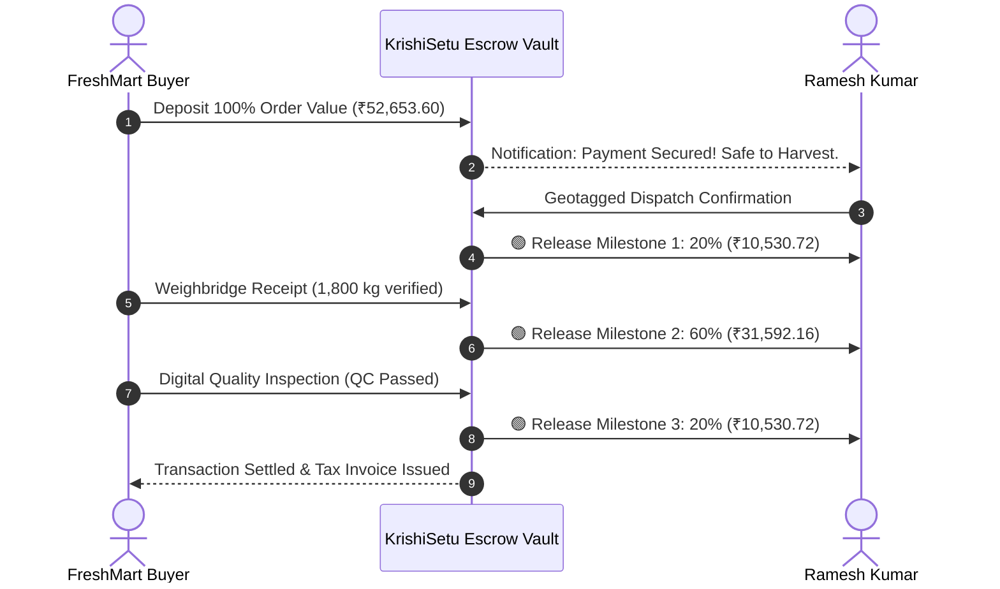

# Aman Kesarwani — Buyer Experience & Negotiation Guide
**Role:** Buyer Experience & Negotiation Lead  
**GitHub:** [`amankesarwani01`](https://github.com/amankesarwani01) • **Email:** `amankesarwani516@gmail.com`  
**Assigned Branch:** `feature/buyer` • **Team:** HackOps (SIH 2026)

---

## 1. Quick Summary (What I Built)
- **Corporate Buyer Procurement Portal (`/buyer`):** Demand posting, grade specifications, MOQ requirements, and active contracts.
- **Bilateral Counter-Offer Protocol:** Eliminates exploitative bargaining with an algorithmic corridor bounded by MSP and market medians.
- **3-Stage Milestone Escrow (`/transactions`):** 20% dispatch, 60% weigh-in, and 20% quality acceptance.
- **Pro-Rata Dispute Engine:** Resolves minor quality deviations mathematically instead of outright load rejection.

---

## 2. In Simple Words (The Metaphor)
> **The 3-Key Safe Deposit Box:** If a buyer pays 100% upfront, the farmer could fail to deliver. If the farmer dispatches with 0% advance, the buyer could refuse to pay. Aman built a bank safe with 3 keys: the buyer puts 100% of the money into the bank vault upfront. Key 1 releases 20% when produce is loaded on the truck (fuel/packing). Key 2 releases 60% when the truck reaches the gate weighbridge. Key 3 releases the final 20% after quality inspection. Both sides are 100% protected.

---

## 3. How It Works (Architecture & Diagram)

---

## 4. Technical Details & Code (From Beginner to Advanced)

### 🟢 Beginner: Corporate Procurement
- Big institutional buyers (FreshMart, AgriFresh) need large, reliable, graded produce shipments.
- Aman built the portal where buyers post requirements (e.g. 50 Quintals Tomato Grade A by Sep 10).

### 🟡 Intermediate: Algorithmic Negotiation Corridor
- To prevent distressed lowball bids, the backend enforces a price corridor:
  $$\text{Price}_{\min} = \max(\text{MSP}, \text{Market Median} - 1.5 \times \sigma)$$
- Bids below $\text{Price}_{\min}$ are blocked at the API layer. Negotiations are capped at 3 rounds.

### 🔴 Advanced: Dispute Quality Deduction Matrix
- If a delivery has minor defects (e.g. 95% Grade A, 5% Grade B), the system applies a proportional adjustment rather than contract cancellation:
  $$\text{Settlement} = (\text{Weight}_A \times \text{Price}_A) + (\text{Weight}_B \times \text{Price}_B)$$
  Farmer receives ₹52,113.60 immediately instead of losing the entire load.

### 📁 Key Files Owned
- [`apps/web/src/app/buyer/page.tsx`](file:///c:/Users/kings/OneDrive/Desktop/SIH/apps/web/src/app/buyer/page.tsx) — Corporate buyer dashboard
- [`apps/web/src/app/transactions/page.tsx`](file:///c:/Users/kings/OneDrive/Desktop/SIH/apps/web/src/app/transactions/page.tsx) — Escrow tracking and milestone releases
- [`packages/shared/src/engines/buyer-matching-engine.ts`](file:///c:/Users/kings/OneDrive/Desktop/SIH/packages/shared/src/engines/buyer-matching-engine.ts) — Demand-supply matching logic
- [`packages/shared/src/engines/ranking-engine.ts`](file:///c:/Users/kings/OneDrive/Desktop/SIH/packages/shared/src/engines/ranking-engine.ts) — Multi-attribute ranking engine
- [`apps/api/src/offers/`](file:///c:/Users/kings/OneDrive/Desktop/SIH/apps/api/src/offers) — Counter-offer backend services

---

## 5. Hackathon Viva & Defense (Top 5 Q&A)

**Q1: Why would large corporate buyers use KrishiSetu?**  
> *"It aggregates fragmented smallholder supply to meet their MOQ, standardizes quality grading, and eliminates delivery reneging via locked escrow contracts."*

**Q2: What prevents a buyer from delaying Milestone 3 (Final 20%) indefinitely?**  
> *"An automated 4-hour inspection timeout. If the buyer does not submit a defect report within 4 hours of weighbridge check-in, the smart contract auto-releases the final 20% to the farmer."*

**Q3: How do you stop buyers from colluding to push prices down?**  
> *"The negotiation corridor mathematically anchors to Government MSP and historical mandi medians. Bids below the corridor are rejected by the API."*

**Q4: What happens if a buyer cancels after produce is harvested?**  
> *"100% of funds are already locked in Escrow. If the buyer cancels, a 30% cancellation penalty is instantly transferred to the farmer to cover harvest and logistics expenses."*

**Q5: How does this differ from traditional APMC commission agents?**  
> *"Middlemen take opaque 5%–10% cuts and delay payments for weeks. KrishiSetu uses transparent zero-commission milestone escrow with instant digital releases directly to bank accounts."*
