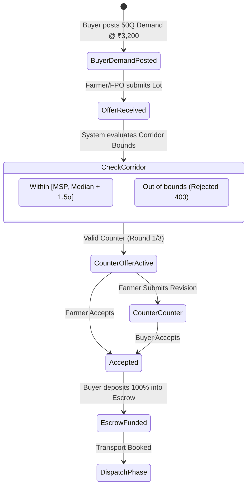
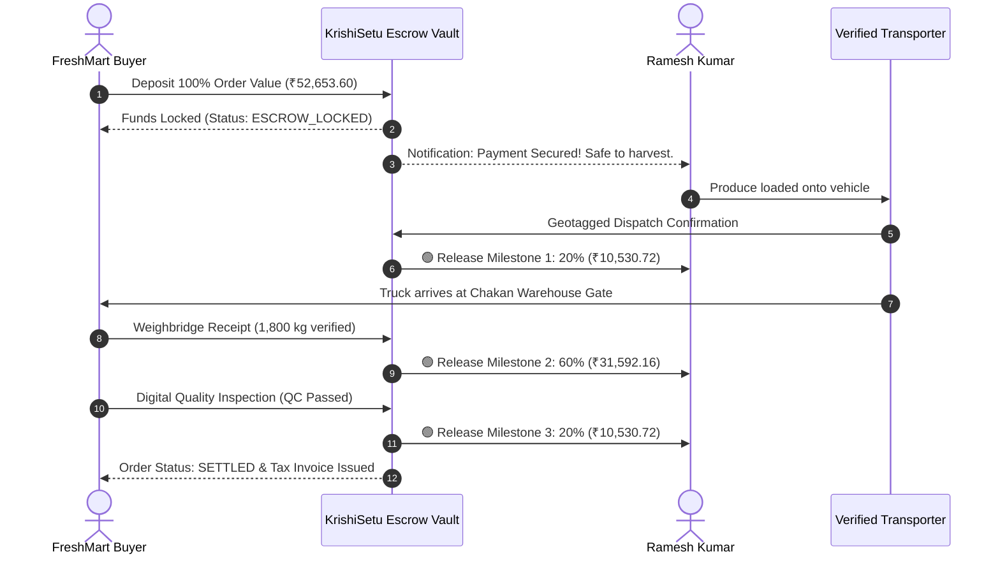

# KrishiSetu Master Study Guide — Aman Kesarwani
**Role:** Buyer Experience & Negotiation Lead  
**GitHub:** [`amankesarwani01`](https://github.com/amankesarwani01) • **Email:** `amankesarwani516@gmail.com`  
**Assigned Branch:** `feature/buyer`  
**Primary Ownership:** Buyer Procurement Portal (`/buyer`), Corporate Demand Posting, Bilateral Counter-Offer Engine, Milestone Escrow Tracking (`/transactions`), Order Contracts & Settlements.

---

## 🧭 Table of Contents
1. [Executive Summary & Responsibilities](#1-executive-summary--responsibilities)
2. [Level 1: Beginner Explanation (The "Why" & The Real-World Analogy)](#2-level-1-beginner-explanation-the-why--the-real-world-analogy)
3. [Level 2: Intermediate Architecture (Negotiation Corridor & Escrow)](#3-level-2-intermediate-architecture-negotiation-corridor--escrow)
4. [Level 3: Advanced Deep Dive (State Machines, Math & Risk Mitigation)](#4-level-3-advanced-deep-dive-state-machines-math--risk-mitigation)
5. [Visual Diagrams](#5-visual-diagrams)
6. [Key Files & Code Artifacts](#6-key-files--code-artifacts)
7. [Hackathon Viva & Judging Defense (Top Q&A)](#7-hackathon-viva--judging-defense-top-qa)

---

## 1. Executive Summary & Responsibilities

As the **Buyer Experience & Negotiation Lead** of Team HackOps for SIH 2026, Aman Kesarwani is responsible for:
- **Corporate Buyer Experience:** Designing institutional procurement workflows for supermarkets, food processing enterprises, and institutional buyers (e.g. FreshMart Foods, AgriFresh Processing).
- **Demand Posting & Matching:** Enabling corporate buyers to specify required grade, crop variety, minimum volume (MOQ), and delivery deadlines.
- **Bilateral Counter-Offer Protocol:** Eliminating chaotic verbal haggling with an algorithmic negotiation corridor that enforces fair pricing bounds.
- **Milestone Escrow Settlements (`/transactions`):** Providing 100% payment security for both farmer and buyer through a verified 3-stage milestone release vault.

---

## 2. Level 1: Beginner Explanation (The "Why" & The Real-World Analogy)

### The Real-World Metaphor: The Safe-Deposit Box with 3 Keys
Imagine buying a custom house:
- If you pay the builder 100% upfront, what if they abandon the project?
- If the builder works with 0% advance, what if you refuse to pay once the roof is finished?

**Aman's solution is the Smart Milestone Escrow:**
1. The buyer deposits 100% of the funds into a secure, neutral bank vault (Escrow).
2. **Key 1 (20% Advance):** Released to the farmer the moment the truck is loaded and dispatched (covers diesel & packing).
3. **Key 2 (60% Delivery):** Released when the truck arrives at the buyer's gate and automated weight bridges verify the volume.
4. **Key 3 (20% Final Settlement):** Released after quality check (moisture, Brix level, color) confirms Grade A compliance.

Both parties are completely protected: the farmer knows the money is already locked in escrow, and the buyer knows funds are only released as physical milestones are proven!

---

## 3. Level 2: Intermediate Architecture (Negotiation Corridor & Escrow)

### The Counter-Offer Negotiation Corridor
Traditional middlemen exploit farmers through distressed bargaining (offering 50% of value when tomatoes are rotting). KrishiSetu introduces **Algorithmic Guardrails**:
- **Price Corridor Boundary:**
  $$\text{Price}_{\min} = \max(\text{MSP}, \text{Market Median} - 1.5 \times \sigma)$$
  $$\text{Price}_{\max} = \text{Market Median} + 1.5 \times \sigma$$
- Any counter-offer submitted by a buyer below $\text{Price}_{\min}$ is rejected at the API layer as **Predatory Pricing Violation**.
- Round limit: Negotiations are capped at **3 rounds** to prevent stalling perishable crops.

### The 3-Stage Escrow Lifecycle
```
[1. Buyer Funds Locked 100%]
       │
       ▼
[2. Dispatch Verification]  ──────> 20% Released to Farmer (Logistics / Packing)
       │
       ▼
[3. Gate Weigh-In]          ──────> 60% Released to Farmer (Core Harvest Value)
       │
       ▼
[4. Quality QC Verified]    ──────> 20% Final Settlement Released
```

---

## 4. Level 3: Advanced Deep Dive (State Machines, Math & Risk Mitigation)

### Negotiation State Transitions
```
OFFER_SUBMITTED 
    │
    ├──> ACCEPTED ──> ESCROW_DEPOSITED
    ├──> COUNTER_OFFERED (Round <= 3) ──> ACCEPTED / REJECTED
    └──> EXPIRED (TTL = 12 Hours)
```

### Dispute Quality Deduction Matrix
If a delivery of 18 Quintals has a minor quality deviation (e.g. 95% Grade A, 5% Grade B with minor blemishes):
- **Old World Outcome:** Buyer rejects entire truckload or forces farmer to accept 50% discount.
- **KrishiSetu Algorithmic Resolution:**
  $$\text{Settlement} = (\text{Weight}_{\text{Grade A}} \times \text{Price}_{\text{Agreed}}) + (\text{Weight}_{\text{Grade B}} \times \text{Price}_{\text{Grade B Baseline}})$$
  $$\text{Deduction} = 0.90 \times \text{Qtl} \times (₹3,100 - ₹2,500) = ₹540$$
  The farmer receives ₹52,113.60 immediately instead of losing the entire ₹52,653 shipment!

---

## 5. Visual Diagrams

### Bilateral Counter-Offer State Machine


### 3-Stage Milestone Escrow Settlement Flow


---

## 6. Key Files & Code Artifacts

| File Path | Description |
|---|---|
| [`apps/web/src/app/buyer/page.tsx`](file:///c:/Users/kings/OneDrive/Desktop/SIH/apps/web/src/app/buyer/page.tsx) | Corporate buyer procurement dashboard, demand post form, active contracts |
| [`apps/web/src/app/transactions/page.tsx`](file:///c:/Users/kings/OneDrive/Desktop/SIH/apps/web/src/app/transactions/page.tsx) | Escrow milestone tracking, counter-offer history, digital payment slips |
| [`packages/shared/src/engines/buyer-matching-engine.ts`](file:///c:/Users/kings/OneDrive/Desktop/SIH/packages/shared/src/engines/buyer-matching-engine.ts) | Algorithmic matching between harvest lots and corporate demand criteria |
| [`packages/shared/src/engines/ranking-engine.ts`](file:///c:/Users/kings/OneDrive/Desktop/SIH/packages/shared/src/engines/ranking-engine.ts) | Multi-attribute ranking (NRP, Trust Score, Distance, Payment terms) |
| [`apps/api/src/offers/`](file:///c:/Users/kings/OneDrive/Desktop/SIH/apps/api/src/offers) | Backend counter-offer service and validation controllers |
| [`apps/api/src/transactions/`](file:///c:/Users/kings/OneDrive/Desktop/SIH/apps/api/src/transactions) | Escrow lifecycle event handlers and milestone triggers |

---

## 7. Hackathon Viva & Judging Defense (Top Q&A)

### Q1: "Why would a large corporate buyer like FreshMart use KrishiSetu instead of buying directly from farmers?"
> **Answer:** "Corporate procurement teams waste huge resources negotiating with hundreds of individual smallholders, verifying quality, and dealing with delivery reneging. KrishiSetu provides institutional buyers with automated quality standardization, consolidated FPO supply matching their exact MOQ, and legally binding digital escrow contracts."

### Q2: "What prevents a buyer from delaying Milestone 3 (Final 20%) indefinitely by claiming they are 'inspecting'?"
> **Answer:** "We built an automated Inspection TTL (Time-To-Live). The buyer is given a strict 4-hour window from gate weigh-in to submit quality test results. If no defect report is filed within 4 hours, the smart contract automatically approves the inspection and releases the final 20% to the farmer."

### Q3: "How does the negotiation corridor prevent collusion between big buyers to suppress prices?"
> **Answer:** "The negotiation corridor dynamically anchors to historical APMC mandi medians and Government Minimum Support Prices (MSP). If a consortium of buyers attempts to offer below the statutory corridor floor, the system flags the transaction and locks bids to the fair median baseline."

### Q4: "What happens if the buyer goes bankrupt or cancels after the farmer harvests the crop?"
> **Answer:** "The harvest instruction is never issued to the farmer until the buyer's payment is 100% pre-funded and locked in Escrow. If the buyer cancels post-harvest, 100% of the funds are already in the escrow vault; the dispatch cancellation penalty (30%) is paid directly to the farmer to cover harvesting and transport costs."

### Q5: "Can you explain the difference between a gross price bid and an escrow-protected net settlement?"
> **Answer:** "A gross price bid is merely an advertised figure that ignores all logistics, deductions, and payment risks. An escrow-protected net settlement is a legally locked payment amount with pre-calculated, transparent deductions, guaranteeing zero hidden deductions upon arrival."
