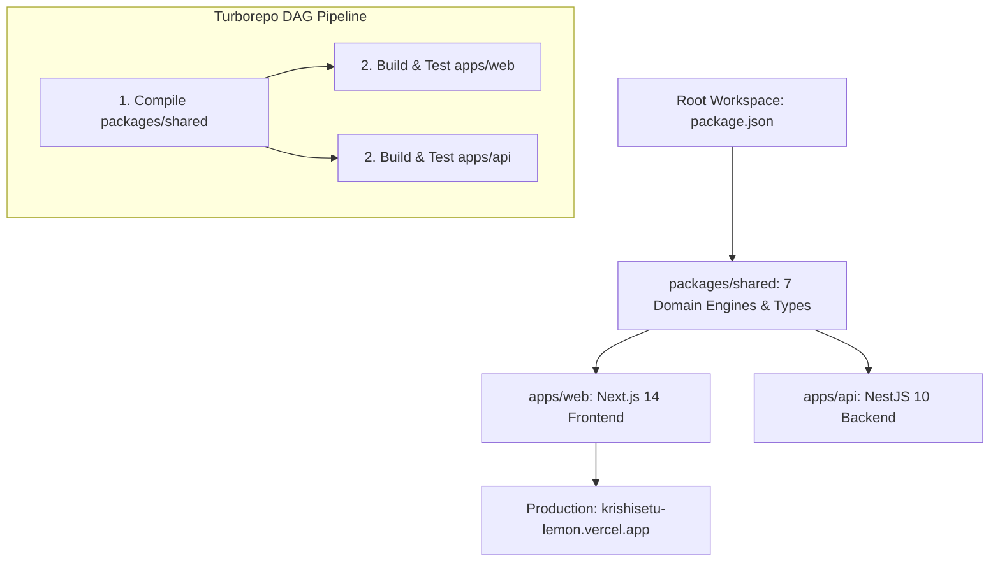

# Ananya Pandey — System Architecture & Monorepo Guide
**Role:** Team Leader & System Architect  
**GitHub:** [`Ananyapandey-dev`](https://github.com/Ananyapandey-dev) • **Email:** `ananyapandey.dev.in@gmail.com`  
**Assigned Branch:** `feature/integration-release` • **Team:** HackOps (SIH 2026)

---

## 1. Quick Summary (What I Built)
- **Turborepo Monorepo:** Unified Next.js 14 frontend, NestJS 10 backend, and shared TypeScript domain engines into a single synchronized repository.
- **Production & Demo Cloud Deployments:** Live Vercel production ([krishisetu-lemon.vercel.app](https://krishisetu-lemon.vercel.app)) and staging ([krishisetu-demo.vercel.app](https://krishisetu-demo.vercel.app)).
- **Single Source of Truth:** Enforced `@krishisetu/shared` package so financial math executes identically across UI and API without drift.
- **CI/CD Quality Gate:** Configured automated test suites with **142/142 tests passing** before any PR can merge.

---

## 2. In Simple Words (The Metaphor)
> **The Chief City Planner:** Imagine building an airport and a train station. If the train tracks and airplane runways are built using different blueprints, they will never connect. Ananya is the Chief Planner who created the single blueprint room (the Monorepo). When a track measurement changes, both the train engineers (Backend) and the ticket masters (Frontend) update together at the exact same second.

---

## 3. How It Works (Architecture & Diagram)



---

## 4. Technical Details & Code (From Beginner to Advanced)

### 🟢 Beginner: Monorepo Organization
- Instead of managing 3 separate GitHub repos, everything lives in one repo:
  - `apps/web`: User interface (Next.js 14, Tailwind).
  - `apps/api`: Business logic (NestJS 10, Prisma).
  - `packages/shared`: Shared math formulas and data types.

### 🟡 Intermediate: Turborepo Pipeline (`turbo.json`)
- `turbo.json` coordinates tasks using a Directed Acyclic Graph (DAG):
  - `^build`: Upstream dependencies build first.
  - Caching avoids rebuilding unchanged code, reducing CI build times from 4 minutes to 30 seconds.

### 🔴 Advanced: Invariant Parity & Deployment
- **Zero Math Drift:** The exact same `calculateNRP()` function is imported by both frontend and backend:
  ```typescript
  import { calculateNRP, CanonicalScenario } from '@krishisetu/shared';
  ```
- **Dual Vercel Parity:** Automated GitHub webhooks deploy `main` to production and `develop` to staging, keeping judges and evaluators isolated from ongoing development.

### 📁 Key Files Owned
- [`turbo.json`](file:///c:/Users/kings/OneDrive/Desktop/SIH/turbo.json) — Monorepo task pipeline configuration
- [`package.json`](file:///c:/Users/kings/OneDrive/Desktop/SIH/package.json) — Root workspaces definition
- [`packages/shared/src/index.ts`](file:///c:/Users/kings/OneDrive/Desktop/SIH/packages/shared/src/index.ts) — Domain engine exports
- [`docs/GIT_WORKFLOW.md`](file:///c:/Users/kings/OneDrive/Desktop/SIH/docs/GIT_WORKFLOW.md) — Team collaboration rules
- [`docs/DEPLOYMENT.md`](file:///c:/Users/kings/OneDrive/Desktop/SIH/docs/DEPLOYMENT.md) — Production deployment runbook

---

## 5. Hackathon Viva & Defense (Top 5 Q&A)

**Q1: Why choose a Monorepo over separate repositories?**  
> *"In agri-fintech, financial calculations must be server-authoritative and identical to what the farmer sees. With a Turborepo monorepo, our 7 domain engines live in `packages/shared`. When a formula is updated, both frontend and backend compile against the exact same code with zero version drift."*

**Q2: How do you prevent 6 developers from overwriting each other's work?**  
> *"We enforced strict Git branch hygiene: each member owned a dedicated `feature/*` branch. Direct commits to `main` and `develop` were prohibited. Merges required approval and passing the 142 automated tests."*

**Q3: How are staging and production separated?**  
> *"We maintain dual Vercel environments: `krishisetu-lemon.vercel.app` tracks `main` for evaluators, and `krishisetu-demo.vercel.app` tracks `develop` for rapid team testing."*

**Q4: How do you verify canonical data consistency?**  
> *"Our test suite executes `demo-consistency.test.ts`. If any change alters Ramesh's 18Q tomato numbers (e.g. FreshMart NRP ₹2,925.20/qtl), the build immediately fails."*

**Q5: What if the backend server experiences latency during the presentation?**  
> *"The frontend has an automated client-side mock fallback that executes the exact `@krishisetu/shared` domain logic locally, ensuring zero downtime during live evaluation."*
