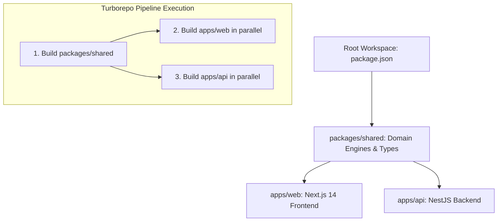
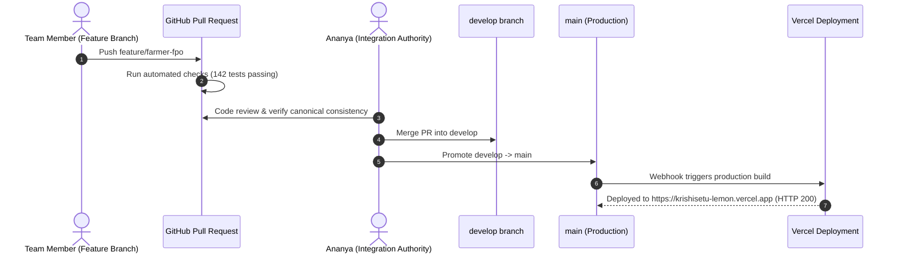

# KrishiSetu Master Study Guide — Ananya Pandey
**Role:** Team Leader & System Architect  
**GitHub:** [`Ananyapandey-dev`](https://github.com/Ananyapandey-dev) • **Email:** `ananyapandey.dev.in@gmail.com`  
**Assigned Branch:** `feature/integration-release`  
**Primary Ownership:** Monorepo Architecture, Turborepo Pipeline, Vercel Production Deployments, CI/CD Gatekeeping, Canonical Data Integrity.

---

## 🧭 Table of Contents
1. [Executive Summary & Responsibilities](#1-executive-summary--responsibilities)
2. [Level 1: Beginner Explanation (The "Why" & The Big Picture)](#2-level-1-beginner-explanation-the-why--the-big-picture)
3. [Level 2: Intermediate Architecture & Monorepo Mechanics](#3-level-2-intermediate-architecture--monorepo-mechanics)
4. [Level 3: Advanced Deep Dive (Pipelines, Vercel & Invariants)](#4-level-3-advanced-deep-dive-pipelines-vercel--invariants)
5. [Visual Diagrams](#5-visual-diagrams)
6. [Key Files & Code Artifacts](#6-key-files--code-artifacts)
7. [Hackathon Viva & Judging Defense (Top Q&A)](#7-hackathon-viva--judging-defense-top-qa)

---

## 1. Executive Summary & Responsibilities

As the **Team Leader and System Architect** of Team HackOps for Smart India Hackathon (SIH 2026, Problem Statement SIH26132), Ananya Pandey is responsible for:
- **Repository Architecture:** Orchestrating the monorepo structure containing `apps/web` (Next.js 14), `apps/api` (NestJS 10), and `packages/shared` (7 domain engines).
- **Turborepo Build Pipeline:** Configuring caching, task dependencies, topological builds, and lint/test workflows across all packages.
- **Production & Staging Deployments:** Managing live production (`https://krishisetu-lemon.vercel.app`) and demo staging (`https://krishisetu-demo.vercel.app`) environments.
- **Single Source of Truth:** Ensuring mathematical integrity across frontend UI displays and backend API validations so no client drift occurs.
- **Git Workflow Gatekeeping:** Enforcing PR rules, branch hygiene (`feature/*` -> `develop` -> `main`), and the 142/142 test pass requirement.

---

## 2. Level 1: Beginner Explanation (The "Why" & The Big Picture)

### The Real-World Metaphor: The Chief City Planner
Imagine building a modern smart city. You have:
- Architects designing the farmer's market stalls (Frontend / Rama & Riya).
- Bank vaults and logistics warehouses (Backend / Jatin & Aman).
- Security guards checking IDs at every gate (Auth & Security / Bhavishya).

If everyone worked in separate private offices with their own private blue-prints, the roads wouldn't connect, the electrical wiring wouldn't match, and the bank vault would speak a different language than the market stall!

**Ananya's role is the Chief City Planner:**
She established a single, unified blueprint room—the **Monorepo**. When a formula changes in the central calculation room (`packages/shared`), both the market stalls and the bank vaults update simultaneously. No communication gaps, no mismatched versions, and every release is guaranteed to work together.

### Core Problems Solved
1. **Dependency Hell:** Avoided having 3 separate repositories that diverge during hackathon crunch time.
2. **"It Works On My Machine":** Enforced unified npm scripts (`npm run build`, `npm test`, `npm run demo:reset`) that run identically on Windows, Linux, and Vercel cloud servers.
3. **Live Public Evaluation:** Provided live, instantly accessible URLs for SIH judges with zero setup required.

---

## 3. Level 2: Intermediate Architecture & Monorepo Mechanics

### Monorepo Layout & Topology
```
KrishiSetu/
├── apps/
│   ├── web/                    # Next.js 14 App Router (Tailwind, Lucide, Portals)
│   └── api/                    # NestJS 10 REST & State Machine Backend
├── packages/
│   └── shared/                 # Shared TypeScript domain engines, DTOs & canonical data
├── docs/                       # Architecture, Deployment, Team, and Member guides
├── turbo.json                  # Turborepo task pipeline definition
├── package.json                # Workspaces root configuration
└── scripts/                    # Demo reset & validation scripts
```

### Turborepo Pipeline (`turbo.json`)
Turborepo creates a directed acyclic graph (DAG) of project tasks:
- `build`: Depends on `^build` (upstream dependencies must build first). `packages/shared` builds before `apps/web` and `apps/api`.
- `test`: Executes across all workspaces in parallel, producing 142 test assertions.
- `lint`: Ensures code cleanliness across TypeScript modules.

```json
{
  "$schema": "https://turbo.build/schema.json",
  "pipeline": {
    "build": {
      "dependsOn": ["^build"],
      "outputs": [".next/**", "!.next/cache/**", "dist/**"]
    },
    "test": {
      "dependsOn": ["^build"],
      "outputs": []
    },
    "lint": {
      "outputs": []
    }
  }
}
```

---

## 4. Level 3: Advanced Deep Dive (Pipelines, Vercel & Invariants)

### Multi-Target Deployment Strategy
1. **Next.js 14 Frontend on Vercel:**
   - Deployed at `https://krishisetu-lemon.vercel.app` (Production) and `https://krishisetu-demo.vercel.app` (Demo).
   - Utilizes Server-Side Rendering (SSR) for real-time market calculation and Client Components (`"use client"`) for interactive state machines.
   - Root Directory configured as `apps/web` with build command `cd ../.. && npx turbo run build --filter=web...`.
2. **Environment Variable Parity:**
   - Production variables configured in Vercel:
     - `NEXT_PUBLIC_API_URL`: Backend REST API gateway.
     - `NEXT_PUBLIC_GOOGLE_CLIENT_ID`: Google OAuth 2.0 Web Client credentials.
     - `JWT_SECRET` & `SMTP_*`: Backend authentication secrets.

### Mathematical Single Source of Truth
The platform has 7 mathematical domain engines located in `packages/shared/src/engines/`:
- If `calculateNRP()` in `nrp-engine.ts` updates its freight formula, both the Next.js frontend and the NestJS backend import the exact same compiled function:
```typescript
import { calculateNRP, CanonicalScenario } from '@krishisetu/shared';
```
This guarantees mathematical parity: **Frontend displays ₹2,925.20/qtl for FreshMart, and Backend accepts settlements at exactly ₹2,925.20/qtl.**

---

## 5. Visual Diagrams

### Monorepo Dependency & Pipeline Graph


### Git Branching & CI/CD Release Flow


---

## 6. Key Files & Code Artifacts

| File Path | Description |
|---|---|
| [`turbo.json`](file:///c:/Users/kings/OneDrive/Desktop/SIH/turbo.json) | Turborepo pipeline caching and topological build order |
| [`package.json`](file:///c:/Users/kings/OneDrive/Desktop/SIH/package.json) | Root workspaces definition (`apps/*`, `packages/*`) |
| [`packages/shared/src/index.ts`](file:///c:/Users/kings/OneDrive/Desktop/SIH/packages/shared/src/index.ts) | Export barrel for all 7 domain engines and TypeScript types |
| [`docs/GIT_WORKFLOW.md`](file:///c:/Users/kings/OneDrive/Desktop/SIH/docs/GIT_WORKFLOW.md) | Branching guidelines, commit standards, and PR protocols |
| [`docs/DEPLOYMENT.md`](file:///c:/Users/kings/OneDrive/Desktop/SIH/docs/DEPLOYMENT.md) | Vercel production and staging deployment runbook |

---

## 7. Hackathon Viva & Judging Defense (Top Q&A)

### Q1: "Why did you choose a Monorepo instead of separate GitHub repositories for frontend and backend?"
> **Answer:** "In an agricultural fintech platform like KrishiSetu, mathematical consistency is critical. Our 7 domain engines—calculating Net Realised Price, spoilage decay, and escrow milestones—must execute identically on the client UI and the server API. By using a Turborepo monorepo with `packages/shared`, we eliminate duplicate code, guarantee type safety end-to-end, and can refactor domain logic in a single atomic commit with 100% build verification."

### Q2: "How do you ensure that 6 team members working simultaneously don't overwrite each other's code?"
> **Answer:** "We implemented strict branch ownership documented in `docs/TEAM.md` and `docs/GIT_WORKFLOW.md`. Each member worked in an isolated `feature/*` branch. Merges to `develop` required approval and passing the test suite of 142 automated tests. Only verified stable code from `develop` was promoted to `main`."

### Q3: "How is the project deployed and how do you handle staging vs production?"
> **Answer:** "We configured dual Vercel environments: `https://krishisetu-lemon.vercel.app` as our production branch tracking `main`, and `https://krishisetu-demo.vercel.app` tracking `develop`. This allows judges to test production while our team can test live feature previews in staging without downtime."

### Q4: "What happens if a developer introduces a calculation bug that breaks the canonical scenario?"
> **Answer:** "Our automated test suite runs `npm test` across all workspaces before any merge. Specifically, `packages/shared/src/engines/__tests__/nrp-engine.spec.ts` verifies Ramesh's 18 Quintal harvest down to the exact decimal: FreshMart at ₹2,925.20/qtl and Pune APMC at ₹2,787/qtl. If any change alters these verified baselines, the build fails immediately."

### Q5: "What is your fallback if the cloud backend experiences latency during the live hackathon demo?"
> **Answer:** "Our Next.js frontend has built-in resilient mock fallbacks that gracefully simulate the backend state machine using the exact compiled `@krishisetu/shared` package. If live backend connectivity drops, the application seamlessly provides full UI interactivity without failing the demo."
