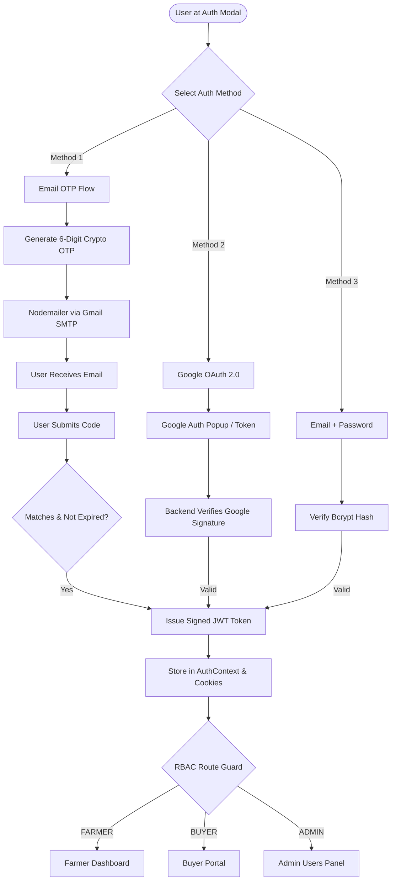
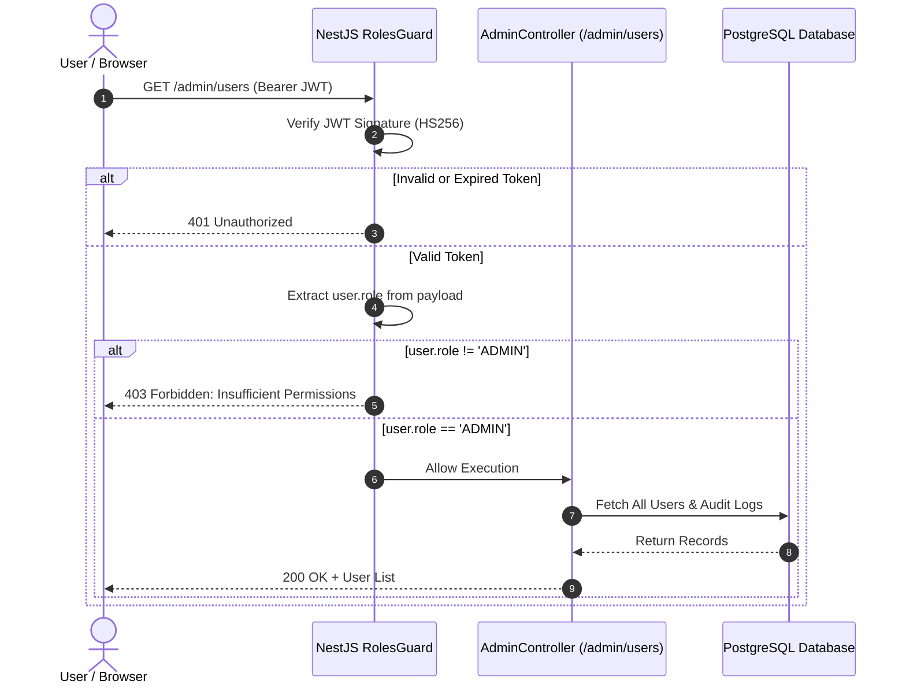

# KrishiSetu Master Study Guide — Bhavishya Gangola
**Role:** Auth, Security & Governance Lead  
**GitHub:** [`bhavishyagangola-dev`](https://github.com/bhavishyagangola-dev) • **Email:** `bhavishyagangola12@gmail.com`  
**Assigned Branch:** `feature/auth-admin`  
**Primary Ownership:** Unified 3-in-1 Auth (Email OTP + Google OAuth 2.0 + Password), RBAC Authorization Guards, Admin Governance (`/admin/users`), Nodemailer SMTP Transport, Audit Logging.

---

## 🧭 Table of Contents
1. [Executive Summary & Responsibilities](#1-executive-summary--responsibilities)
2. [Level 1: Beginner Explanation (The "Why" & The Real-World Analogy)](#2-level-1-beginner-explanation-the-why--the-real-world-analogy)
3. [Level 2: Intermediate Architecture (3-in-1 Auth & RBAC)](#3-level-2-intermediate-architecture-3-in-1-auth--rbac)
4. [Level 3: Advanced Deep Dive (Cryptographic Protocols & SMTP Resilience)](#4-level-3-advanced-deep-dive-cryptographic-protocols--smtp-resilience)
5. [Visual Diagrams](#5-visual-diagrams)
6. [Key Files & Code Artifacts](#6-key-files--code-artifacts)
7. [Hackathon Viva & Judging Defense (Top Q&A)](#7-hackathon-viva--judging-defense-top-qa)

---

## 1. Executive Summary & Responsibilities

As the **Auth, Security & Governance Lead** of Team HackOps for SIH 2026, Bhavishya Gangola is responsible for:
- **Inclusive Multi-Modal Authentication:** Bridging the digital divide with passwordless 6-digit Email OTP for rural farmers, Google OAuth 2.0 for quick corporate logins, and standard password authentication.
- **Enterprise Email Transport:** Building the Nodemailer SMTP integration with automated whitespace stripping and fallback delivery logging.
- **Google OAuth 2.0 Integration:** Configuring Google Web Client verification (`1005466312619-t60vu0m5323j3cbv4ujb493s82q0s40a.apps.googleusercontent.com`) on both Next.js and NestJS.
- **Role-Based Access Control (RBAC):** Protecting sensitive API endpoints with `@Roles('ADMIN', 'FPO_ADMIN', 'BUYER', 'FARMER')` and NestJS `RolesGuard`.
- **Administrative Governance (`/admin/users`):** Real-time dashboard for user management, role upgrades, account suspension, and audit logs.

---

## 2. Level 1: Beginner Explanation (The "Why" & The Real-World Analogy)

### The Real-World Metaphor: The Three-Lane Security Gate
Imagine a secure government building visited by three very different types of people:
1. **The Village Farmer (Ramesh):** Doesn't remember 16-character passwords with symbols like `@#%$!`. He wants a quick 6-digit SMS/Email code sent to his phone that expires in 10 minutes.
2. **The Corporate Executive (FreshMart):** Already logged into his work Google Account. He wants to click "Sign in with Google" in 1 second.
3. **The System Administrator:** Wants a permanent, encrypted master credential with high-privilege access.

**Bhavishya built the Unified 3-Lane Gate:**
All three lanes lead to the same high-security passport office. Once your identity is proven, you are given a tamper-proof digital badge (**JWT Token**) that tells every door in the building exactly which rooms you are allowed to enter.

---

## 3. Level 2: Intermediate Architecture (3-in-1 Auth & RBAC)

### The Three Authentication Channels
1. **Email OTP Flow:**
   - User inputs email $\rightarrow$ System generates 6-digit cryptographically random OTP (e.g. `482910`).
   - Stored in memory/Redis with 10-minute TTL and salt hash.
   - Nodemailer dispatches an HTML email via Google SMTP.
   - User inputs OTP $\rightarrow$ Backend validates $\rightarrow$ Issues JWT.
2. **Google OAuth 2.0:**
   - User clicks Google Sign-In button on `AuthModal.tsx`.
   - Google returns an `id_token` signed by Google's public keys.
   - Backend decodes and verifies audience and expiration $\rightarrow$ Upserts User profile $\rightarrow$ Issues JWT.
3. **Password & JWT:**
   - Passwords hashed using `bcrypt` (10 rounds).
   - JWT tokens signed with `HS256` secret containing payload `{ id, email, role }`.

### Role-Based Access Control (RBAC) Matrix
| Route / Endpoint | Farmer | Buyer | FPO Admin | System Admin |
|---|:---:|:---:|:---:|:---:|
| `/dashboard` (My Harvest & NRP) | ✅ | ❌ | ✅ | ✅ |
| `/lots` (Create & Sell Lots) | ✅ | ❌ | ✅ | ✅ |
| `/buyer` (Corporate Demand) | ❌ | ✅ | ❌ | ✅ |
| `/fpo` (Aggregate Logistics) | ✅ | ❌ | ✅ | ✅ |
| `/admin/users` (User Governance)| ❌ | ❌ | ❌ | ✅ |

---

## 4. Level 3: Advanced Deep Dive (Cryptographic Protocols & SMTP Resilience)

### Gmail App Password Whitespace Normalization
A classic production failure in hackathon demos occurs when copy-pasting a Google App Password containing 4-character spaces (`vrek fdak fksg zyuy`). If passed raw to SMTP, Google rejects with `535-5.7.8 Username and Password not accepted`.
Bhavishya engineered proactive sanitization in `email.service.ts`:
```typescript
const cleanPassword = (process.env.SMTP_PASSWORD || '').replace(/\s+/g, '');
this.transporter = nodemailer.createTransport({
  host: process.env.SMTP_HOST || 'smtp.gmail.com',
  port: Number(process.env.SMTP_PORT) || 587,
  secure: false, // TLS
  auth: {
    user: process.env.SMTP_USER,
    pass: cleanPassword, // Strips any pasted whitespace!
  },
});
```

### Protection Against Brute-Force & Replay Attacks
- **OTP Expiration:** Exactly 600 seconds (10 minutes).
- **Max Failed Attempts:** 3 incorrect OTP entries locks the code and purges it.
- **Single-Use Invalidation:** As soon as an OTP is successfully redeemed, it is deleted from the active cache to prevent replay attacks.
- **JWT Expiration:** Access tokens expire in 24 hours.

---

## 5. Visual Diagrams

### 3-in-1 Unified Authentication Architecture


### RBAC Permission Enforcement Flow


---

## 6. Key Files & Code Artifacts

| File Path | Description |
|---|---|
| [`apps/api/src/auth/auth.service.ts`](file:///c:/Users/kings/OneDrive/Desktop/SIH/apps/api/src/auth/auth.service.ts) | OTP generation, JWT signing, password hashing, Google verification |
| [`apps/api/src/email/email.service.ts`](file:///c:/Users/kings/OneDrive/Desktop/SIH/apps/api/src/email) | Nodemailer Gmail SMTP transport with password normalization |
| [`apps/web/src/components/AuthModal.tsx`](file:///c:/Users/kings/OneDrive/Desktop/SIH/apps/web/src/components/AuthModal.tsx) | 3-tab login/signup modal with React portal rendering |
| [`apps/web/src/lib/auth-context.tsx`](file:///c:/Users/kings/OneDrive/Desktop/SIH/apps/web/src/lib/auth-context.tsx) | React AuthContext providing global `user`, `login()`, and `logout()` |
| [`apps/web/src/app/admin/users/page.tsx`](file:///c:/Users/kings/OneDrive/Desktop/SIH/apps/web/src/app/admin/users/page.tsx) | Administrative user management and role promotion interface |

---

## 7. Hackathon Viva & Judging Defense (Top Q&A)

### Q1: "Why did you build Email OTP instead of just asking farmers to use passwords?"
> **Answer:** "Password fatigue and credential theft are rampant among rural users. Farmers frequently forget complex passwords or share them insecurely. Email/SMS OTP offers zero-friction, passwordless onboarding with 10-minute cryptographic expiration, drastically reducing login support friction while increasing account security."

### Q2: "What if Google SMTP blocks your requests during the live hackathon demonstration?"
> **Answer:** "We implemented defensive fallback logging in `email.service.ts`. If external internet to Google's SMTP server is interrupted, the backend catches the transport exception, automatically prints the generated 6-digit OTP directly to the terminal stdout console, and displays an unobtrusive dev notification, guaranteeing our live demo never stalls."

### Q3: "How does your RBAC architecture stop a farmer from accessing admin endpoints?"
> **Answer:** "We use NestJS declarative decorators: `@UseGuards(JwtAuthGuard, RolesGuard)` and `@Roles('ADMIN')`. The `RolesGuard` extracts the user's role from the cryptographically signed JWT payload. Even if a user manually changes their role in browser LocalStorage, the server rejects the request because the signature validation fails on the backend."

### Q4: "How are Google OAuth tokens verified without exposing secret keys to the browser?"
> **Answer:** "The browser frontend only receives a public client token from the Google Sign-In SDK. It transmits this credential to our `/api/auth/google` endpoint. Our NestJS backend uses Google's `OAuth2Client.verifyIdToken` to verify the digital cryptographic signature against Google's public certs, confirming that the user's identity was certified by Google."

### Q5: "What auditing mechanisms exist for sensitive administrative actions?"
> **Answer:** "Every privilege escalation (e.g. promoting a user from `FARMER` to `FPO_ADMIN`) creates an immutable record in our `AuditLog` database table, recording the actor ID, target user ID, IP address, timestamp, and previous vs new role."
