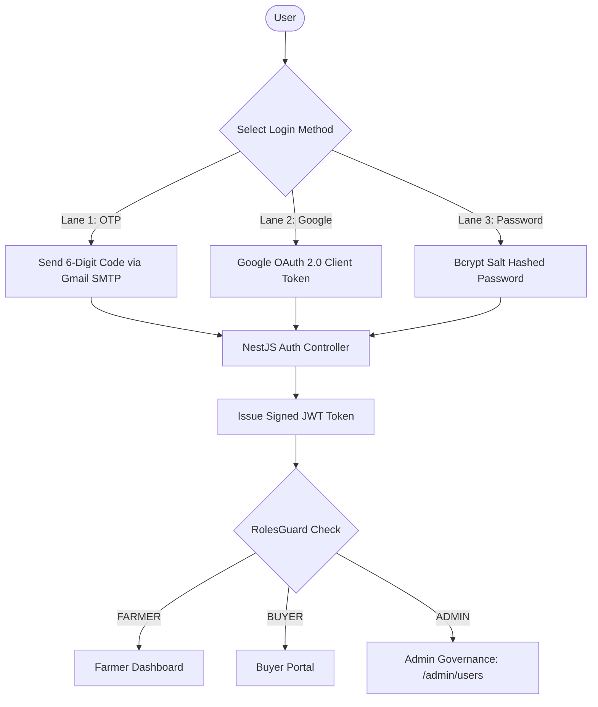

# Bhavishya Gangola — Auth, Security & Governance Guide
**Role:** Auth, Security & Governance Lead  
**GitHub:** [`bhavishyagangola-dev`](https://github.com/bhavishyagangola-dev) • **Email:** `bhavishyagangola12@gmail.com`  
**Assigned Branch:** `feature/auth-admin` • **Team:** HackOps (SIH 2026)

---

## 1. Quick Summary (What I Built)
- **3-in-1 Unified Authentication:** Passwordless 6-digit Email OTP, Google OAuth 2.0 Web Client, and encrypted password auth.
- **Gmail SMTP Transport:** Built the Nodemailer service with automated whitespace sanitization and demo console fallback.
- **Role-Based Access Control (RBAC):** NestJS `@Roles()` decorators and `RolesGuard` protecting `FARMER`, `BUYER`, `FPO_ADMIN`, and `ADMIN`.
- **Admin Governance Portal (`/admin/users`):** User management, role elevation, and audit logs.

---

## 2. In Simple Words (The Metaphor)
> **The 3-Lane Gatekeeper:** Imagine entering a high-security airport:
> 1. The local farmer doesn't remember complicated passwords—he uses **Lane 1: Fast 6-digit code sent to his email**.
> 2. The corporate executive uses **Lane 2: One-tap Google Sign-In**.
> 3. The system administrator uses **Lane 3: Encrypted master password**.
> Once verified, everyone receives a digital wristband (**JWT Token**) that only unlocks the specific doors they are authorized to enter.

---

## 3. How It Works (Architecture & Diagram)



---

## 4. Technical Details & Code (From Beginner to Advanced)

### 🟢 Beginner: 3 Easy Ways to Sign In
- Farmers use OTP (no password to forget).
- Corporate buyers use Google OAuth (instant 1-click).
- Admins use password credentials.

### 🟡 Intermediate: Enterprise SMTP with Sanitization
- Copy-pasting Google App Passwords often includes spaces (`vrek fdak fksg zyuy`).
- Bhavishya built automatic whitespace stripping in `email.service.ts`:
  ```typescript
  const cleanPassword = (process.env.SMTP_PASSWORD || '').replace(/\s+/g, '');
  ```
- If external SMTP fails, fallback logging prints the OTP to terminal stdout for smooth evaluations.

### 🔴 Advanced: RBAC & Token Security
- **JWT Signing:** HS256 algorithm with 24-hour expiration.
- **Rate Limiting:** OTP codes expire in 10 minutes; capped at 3 attempts per email.
- **RBAC Decorators:**
  ```typescript
  @UseGuards(JwtAuthGuard, RolesGuard)
  @Roles('ADMIN')
  @Get('users')
  getAllUsers() { ... }
  ```

### 📁 Key Files Owned
- [`apps/api/src/auth/auth.service.ts`](file:///c:/Users/kings/OneDrive/Desktop/SIH/apps/api/src/auth/auth.service.ts) — Authentication logic & JWT signing
- [`apps/api/src/email/email.service.ts`](file:///c:/Users/kings/OneDrive/Desktop/SIH/apps/api/src/email) — Nodemailer Gmail SMTP integration
- [`apps/web/src/components/AuthModal.tsx`](file:///c:/Users/kings/OneDrive/Desktop/SIH/apps/web/src/components/AuthModal.tsx) — Unified 3-tab auth modal
- [`apps/web/src/lib/auth-context.tsx`](file:///c:/Users/kings/OneDrive/Desktop/SIH/apps/web/src/lib/auth-context.tsx) — Global React auth state
- [`apps/web/src/app/admin/users/page.tsx`](file:///c:/Users/kings/OneDrive/Desktop/SIH/apps/web/src/app/admin/users/page.tsx) — Admin governance panel

---

## 5. Hackathon Viva & Defense (Top 5 Q&A)

**Q1: Why build Email OTP instead of just username/password?**  
> *"Rural farmers often suffer from password fatigue. Email OTP provides zero-friction, passwordless login with 10-minute cryptographic expiration, preventing account takeover without remembering passwords."*

**Q2: How do you verify Google OAuth tokens securely?**  
> *"The browser frontend sends Google's credential to our backend. The backend uses Google's official `OAuth2Client.verifyIdToken` to cryptographically verify the signature against Google's public certs."*

**Q3: How does RBAC prevent unauthorized access?**  
> *"Every protected route passes through `RolesGuard`. The role is signed inside the JWT payload. Even if a user edits their role in browser LocalStorage, the server verifies the cryptographic signature and rejects the request."*

**Q4: How do you prevent OTP brute-force attacks?**  
> *"Each OTP is limited to 3 attempts and has a 600-second TTL. Once used or exceeded, it is immediately deleted from memory."*

**Q5: What happens if the SMTP server is down during judging?**  
> *"Our email service includes defensive fallback logging. If internet to Gmail SMTP drops, the backend automatically prints the generated 6-digit OTP directly to the terminal stdout for instant retrieval."*
