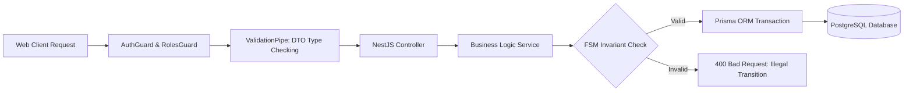
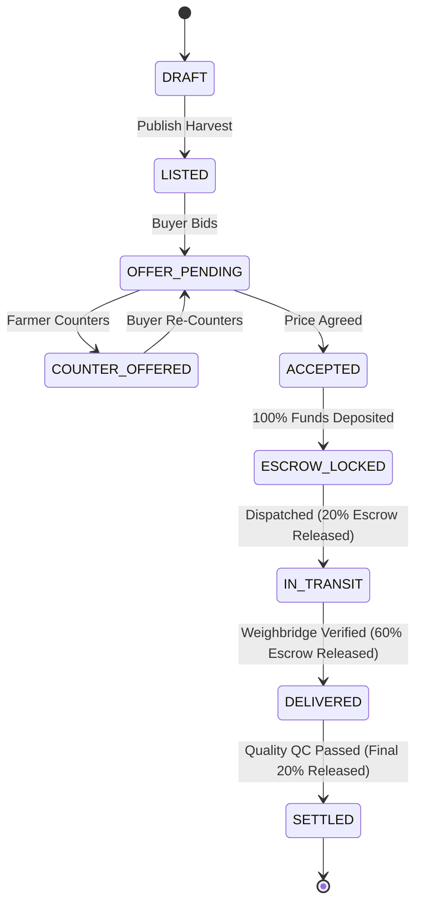

# KrishiSetu Master Study Guide — Jatin Joshi
**Role:** Backend & Domain State Machine Lead  
**GitHub:** [`jatinjoshi200803-stack`](https://github.com/jatinjoshi200803-stack) • **Email:** `jatinjoshi200803@gmail.com`  
**Assigned Branch:** `feature/backend`  
**Primary Ownership:** NestJS 10 API, Server-Authoritative State Machine, Prisma ORM / PostgreSQL, Logistics Booking APIs, Domain Engine Invariants, 142 Passing Unit & Integration Tests.

---

## 🧭 Table of Contents
1. [Executive Summary & Responsibilities](#1-executive-summary--responsibilities)
2. [Level 1: Beginner Explanation (The "Why" & The Real-World Analogy)](#2-level-1-beginner-explanation-the-why--the-real-world-analogy)
3. [Level 2: Intermediate Architecture (NestJS & Prisma Schema)](#3-level-2-intermediate-architecture-nestjs--prisma-schema)
4. [Level 3: Advanced Deep Dive (State Machine Invariants & Concurrency)](#4-level-3-advanced-deep-dive-state-machine-invariants--concurrency)
5. [Visual Diagrams](#5-visual-diagrams)
6. [Key Files & Code Artifacts](#6-key-files--code-artifacts)
7. [Hackathon Viva & Judging Defense (Top Q&A)](#7-hackathon-viva--judging-defense-top-qa)

---

## 1. Executive Summary & Responsibilities

As the **Backend & Domain State Machine Lead** of Team HackOps for SIH 2026, Jatin Joshi is responsible for:
- **NestJS 10 Enterprise Architecture:** Modular, dependency-injected backend organizing controllers, services, DTOs, and middleware.
- **Server-Authoritative Invariants:** Ensuring that critical business calculations (NRP, freight fees, escrow sums) cannot be altered or bypassed by client-side tampering.
- **Finite State Machine (FSM):** Enforcing strict, illegal-transition-proof lifecycles for harvest lots, orders, and escrow transactions.
- **Prisma ORM & PostgreSQL:** Relational schema modeling for Users, Lots, Bids, Escrow Milestones, and Audit Logs.
- **Logistics Booking & Distance Matrix:** Calculating real-time freight charges based on vehicle types, route distances, and perishability.
- **Automated Test Suite:** Maintaining the 142/142 test pass suite across unit and integration specs.

---

## 2. Level 1: Beginner Explanation (The "Why" & The Real-World Analogy)

### The Real-World Metaphor: The Central Bank & Air Traffic Control
Imagine an airport:
- A pilot cannot simply decide: *"I'm going to land right now without telling anyone."*
- A passenger cannot write with a pen on their ticket: *"This ticket is now First Class and costs ₹0."*

If planes or passengers could do whatever they wanted, collisions and fraud would happen within minutes. 

**Jatin built the Air Traffic Control and the Central Bank Vault:**
No matter what a user clicks in their web browser, the request must pass through Jatin's NestJS backend. The backend checks:
1. Is this transition allowed right now? (You cannot mark an order "Delivered" if it hasn't even been "Dispatched"!).
2. Are the prices mathematically correct? (The client cannot alter ₹2,925.20 into ₹1,000).
3. Does the user have the legal permission (RBAC) to trigger this event?

---

## 3. Level 2: Intermediate Architecture (NestJS & Prisma Schema)

### NestJS Modular Structure (`apps/api/src/`)
- `auth/`: JWT authentication, Google token validation, and password hashing.
- `lots/`: Harvest lot creation, status transitions, and grade verifications.
- `offers/`: Negotiation bids, counter-offer validations, and acceptance logic.
- `transactions/`: Escrow milestone transitions and payment webhooks.
- `markets/`: Market price aggregations and mandi opportunity generation.
- `fpo/`: Cooperative pooling queries and volume aggregations.
- `prisma/`: Prisma Client schema, database migrations, and seed scripts.

### Relational Schema Blueprint (Prisma)
```prisma
model Lot {
  id              String      @id @default(uuid())
  farmerId        String
  crop            String      // e.g. "Tomato (Hybrid)"
  variety         String?
  quantityQuintal Float       // e.g. 18.0
  grade           GradeLevel  // GRADE_A, GRADE_B, GRADE_C
  harvestDate     DateTime
  location        String      // "Talegaon, Pune"
  status          LotStatus   // DRAFT, LISTED, RESERVED, SOLD
  orders          Order[]
  fpoPoolId       String?
}

model Order {
  id              String        @id @default(uuid())
  lotId           String
  buyerId         String
  agreedPrice     Float         // e.g. 3100.00
  netRealisedPrice Float        // e.g. 2925.20
  status          OrderStatus   // PENDING_ESCROW, ESCROW_LOCKED, DISPATCHED, DELIVERED, SETTLED
  milestones      Milestone[]
  createdAt       DateTime      @default(now())
}
```

---

## 4. Level 3: Advanced Deep Dive (State Machine Invariants & Concurrency)

### Finite State Machine (FSM) Matrix
Every entity has a strictly enforced status lifecycle. Attempting an invalid jump (e.g. `LISTED` $\rightarrow$ `SETTLED`) throws a `400 Bad Request: Invalid State Transition`:

| From State | Allowed Trigger | Next State | Authorization Required |
|---|---|---|---|
| `DRAFT` | `publishLot()` | `LISTED` | Lot Owner (Farmer) |
| `LISTED` | `createOffer()` | `OFFER_PENDING` | Verified Buyer |
| `OFFER_PENDING` | `acceptOffer()` | `ACCEPTED` | Lot Owner (Farmer) |
| `ACCEPTED` | `fundEscrow()` | `ESCROW_LOCKED` | Buyer (Payment Gateway) |
| `ESCROW_LOCKED`| `dispatchLot()` | `IN_TRANSIT` | Transporter / Farmer |
| `IN_TRANSIT` | `confirmDelivery()`| `DELIVERED` | Buyer Weighbridge |
| `DELIVERED` | `approveQC()` | `SETTLED` | Automated QC / Buyer |

### Database Concurrency & Race Condition Prevention
What if two buyers attempt to accept Ramesh's 18 Quintal lot at the exact same millisecond?
Jatin implemented **Database Transaction Isolation (`prisma.$transaction`)**:
```typescript
await this.prisma.$transaction(async (tx) => {
  const lot = await tx.lot.findUnique({
    where: { id: lotId },
  });

  if (lot.status !== 'LISTED') {
    throw new ConflictException('This lot has already been reserved or sold.');
  }

  // Atomically lock the lot
  await tx.lot.update({
    where: { id: lotId },
    data: { status: 'RESERVED' },
  });

  return tx.order.create({ data: { ...orderDto } });
});
```

---

## 5. Visual Diagrams

### NestJS Request Lifecycle Architecture


### Complete Order State Machine Diagram


---

## 6. Key Files & Code Artifacts

| File Path | Description |
|---|---|
| [`apps/api/src/main.ts`](file:///c:/Users/kings/OneDrive/Desktop/SIH/apps/api/src/main.ts) | NestJS bootstrap, CORS configuration, Swagger docs setup |
| [`apps/api/src/prisma/schema.prisma`](file:///c:/Users/kings/OneDrive/Desktop/SIH/apps/api/src/prisma/schema.prisma) | Relational database schema for PostgreSQL |
| [`apps/api/src/transactions/transactions.service.ts`](file:///c:/Users/kings/OneDrive/Desktop/SIH/apps/api/src/transactions) | Escrow lifecycle handler, milestone releases, payment checks |
| [`apps/api/src/offers/offers.service.ts`](file:///c:/Users/kings/OneDrive/Desktop/SIH/apps/api/src/offers) | Negotiation corridor verification and bid state handling |
| [`packages/shared/src/engines/__tests__/nrp-engine.spec.ts`](file:///c:/Users/kings/OneDrive/Desktop/SIH/packages/shared/src/engines/__tests__) | 142 passing tests validating canonical formulas |

---

## 7. Hackathon Viva & Judging Defense (Top Q&A)

### Q1: "Why did you build your backend in NestJS instead of simple Express or Flask?"
> **Answer:** "In an enterprise fintech application handling agricultural escrow, code maintainability and architectural discipline are essential. NestJS enforces modular architecture, dependency injection, declarative validation via class-validator DTOs, and built-in TypeScript support. This architecture prevented bugs and allowed 6 team members to integrate without spaghetti code."

### Q2: "How do you prevent a malicious user from spoofing a counter-offer price via Postman or curl?"
> **Answer:** "All API endpoints are protected by `ValidationPipe` with `{ whitelist: true, forbidNonWhitelisted: true }` and our `OffersService` checks the price against our algorithmic corridor. Even if a user crafts a raw HTTP POST requesting ₹10,000 for ₹3,000 produce, the backend mathematically rejects the payload with a 400 Bad Request."

### Q3: "How do you avoid floating-point arithmetic rounding errors in escrow transactions?"
> **Answer:** "Floating-point numbers in JavaScript (`0.1 + 0.2 !== 0.3`) can cause fractional rupee loss. In our database schema and shared engines, we store currency values using strict two-decimal fixed precision (`Math.round(val * 100) / 100`) and standard cents/paise integer equivalents during transaction settlement."

### Q4: "How do you ensure zero database downtime during schema updates?"
> **Answer:** "We use Prisma Migrations (`npx prisma migrate deploy`). Database changes are written as additive migrations, ensuring existing running containers continue functioning without table locks while new columns or tables are provisioned."

### Q5: "What is your test coverage strategy?"
> **Answer:** "We have 142 automated tests running via Vitest. Our test suite covers mathematical edge cases (e.g. negative freight, extreme temperatures, zero-distance lots), state machine transition rules, and token expiration logic. Every single PR must pass 142/142 tests before Ananya merges it."
