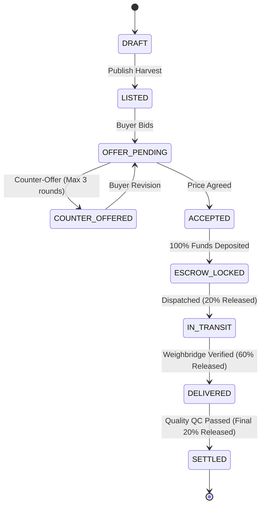

# Jatin Joshi — Backend & Domain State Machine Guide
**Role:** Backend & Domain State Machine Lead  
**GitHub:** [`jatinjoshi200803-stack`](https://github.com/jatinjoshi200803-stack) • **Email:** `jatinjoshi200803@gmail.com`  
**Assigned Branch:** `feature/backend` • **Team:** HackOps (SIH 2026)

---

## 1. Quick Summary (What I Built)
- **NestJS 10 Architecture:** Dependency injection, modular controllers, services, and DTO validation pipes.
- **Server-Authoritative State Machine:** Prevents illegal order/escrow transitions (e.g. `LISTED` cannot jump directly to `SETTLED`).
- **Prisma ORM & PostgreSQL:** Relational modeling for Users, Lots, Orders, Milestones, and immutable Audit Logs.
- **Concurrency & Race Conditions:** Database transaction locks (`prisma.$transaction`) preventing double-selling.
- **142 Passing Tests:** Vitest test suite validating domain engines and state transition invariants.

---

## 2. In Simple Words (The Metaphor)
> **Air Traffic Control & Central Vault:** An airplane pilot cannot just land without permission, and a traveler cannot change the ticket price from ₹3,000 to ₹0. Jatin built the Air Traffic Control and the Bank Vault. Whatever buttons a user clicks in the browser, Jatin's NestJS backend verifies: "Is this transition legal right now? Is the math accurate? Does this user have permission?" If not, the request is rejected immediately.

---

## 3. How It Works (Architecture & Diagram)



---

## 4. Technical Details & Code (From Beginner to Advanced)

### 🟢 Beginner: Why Backend Rules Matter
- You cannot trust calculations in the browser. A malicious user could edit prices in Chrome DevTools.
- All monetary math and status updates must happen inside Jatin's NestJS backend.

### 🟡 Intermediate: Prisma Relational Schema
- Relational schema connecting `User` $\leftrightarrow$ `Lot` $\leftrightarrow$ `Order` $\leftrightarrow$ `Milestone`.
- All financial numbers use fixed 2-decimal precision (`Math.round(val * 100) / 100`) to prevent floating-point rounding errors.

### 🔴 Advanced: Atomic Concurrency & Invariants
- When two buyers accept the same harvest simultaneously, `prisma.$transaction` locks the record:
  ```typescript
  await this.prisma.$transaction(async (tx) => {
    const lot = await tx.lot.findUnique({ where: { id: lotId } });
    if (lot.status !== 'LISTED') throw new ConflictException('Already reserved');
    await tx.lot.update({ where: { id: lotId }, data: { status: 'RESERVED' } });
    return tx.order.create({ data: { ...dto } });
  });
  ```
- Any illegal transition throws `400 Bad Request: Invalid State Transition`.

### 📁 Key Files Owned
- [`apps/api/src/main.ts`](file:///c:/Users/kings/OneDrive/Desktop/SIH/apps/api/src/main.ts) — Backend entrypoint, CORS, Swagger setup
- [`apps/api/src/prisma/schema.prisma`](file:///c:/Users/kings/OneDrive/Desktop/SIH/apps/api/src/prisma/schema.prisma) — Database schema
- [`apps/api/src/transactions/transactions.service.ts`](file:///c:/Users/kings/OneDrive/Desktop/SIH/apps/api/src/transactions) — Escrow lifecycle service
- [`apps/api/src/offers/offers.service.ts`](file:///c:/Users/kings/OneDrive/Desktop/SIH/apps/api/src/offers) — Counter-offer validation
- [`packages/shared/src/engines/__tests__/nrp-engine.spec.ts`](file:///c:/Users/kings/OneDrive/Desktop/SIH/packages/shared/src/engines/__tests__) — Automated test assertions

---

## 5. Hackathon Viva & Defense (Top 5 Q&A)

**Q1: Why NestJS over plain Express?**  
> *"NestJS provides enterprise-grade modular architecture, dependency injection, and declarative DTO validation pipes. This keeps our codebase scalable and decoupled as multiple team members contribute."*

**Q2: How do you prevent price tampering via Postman?**  
> *"All endpoints enforce `ValidationPipe({ whitelist: true })` and validate bids against the algorithmic price corridor. Tampered numbers are rejected before reaching business services."*

**Q3: How do you avoid JavaScript floating-point rounding errors?**  
> *"We store values as 2-decimal fixed numbers and perform money calculations using integer paise/cents during settlements."*

**Q4: How do you prevent race conditions when lots are reserved?**  
> *"We use Prisma transactional isolation (`prisma.$transaction`). The lot status check and status update happen atomically in a single database transaction lock."*

**Q5: What is your test coverage?**  
> *"142 automated tests running via Vitest, covering all 7 mathematical engines, state transitions, and edge cases like zero distance and negative freight."*
