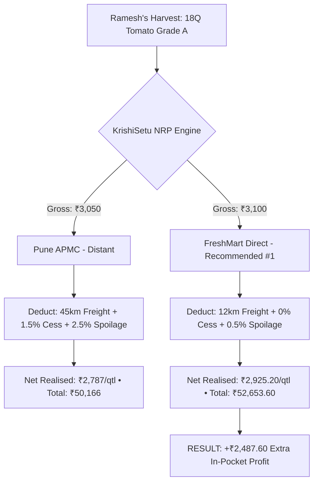
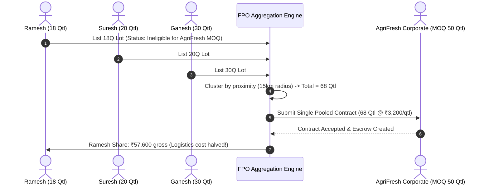

# KrishiSetu Master Study Guide — Rama
**Role:** Farmer & FPO Experience Lead  
**GitHub:** [`ramako7777-spec`](https://github.com/ramako7777-spec) • **Email:** `ramako7777@gmail.com`  
**Assigned Branch:** `feature/farmer-fpo`  
**Primary Ownership:** Farmer Command Center (`/dashboard`), Markets & Buyers (`/markets`), Harvest Lots (`/lots`), FPO Collective Logistics Pooling (`/fpo`), Ramesh Kumar 18Q Tomato Golden Scenario.

---

## 🧭 Table of Contents
1. [Executive Summary & Responsibilities](#1-executive-summary--responsibilities)
2. [Level 1: Beginner Explanation (The "Why" & The Real-World Analogy)](#2-level-1-beginner-explanation-the-why--the-real-world-analogy)
3. [Level 2: Intermediate Architecture (NRP Engine & FPO Clustering)](#3-level-2-intermediate-architecture-nrp-engine--fpo-clustering)
4. [Level 3: Advanced Deep Dive (Mathematical Formulations & Invariants)](#4-level-3-advanced-deep-dive-mathematical-formulations--invariants)
5. [Visual Diagrams](#5-visual-diagrams)
6. [Key Files & Code Artifacts](#6-key-files--code-artifacts)
7. [Hackathon Viva & Judging Defense (Top Q&A)](#7-hackathon-viva--judging-defense-top-qa)

---

## 1. Executive Summary & Responsibilities

As the **Farmer & FPO Experience Lead** of Team HackOps for SIH 2026, Rama is responsible for:
- **The Core Farmer Journey:** Enabling smallholder farmers to make data-driven sales decisions instead of falling for misleading mandi headline rates.
- **Farmer Command Center (`/dashboard`):** Real-time actionable decision cards summarizing today's best practical opportunity.
- **7-Channel Market Comparison (`/markets`):** Transparent ranking of traditional APMC mandis vs direct corporate processors by **Net Realised Price (NRP)**.
- **Lot Management (`/lots`):** Creating, tracking, and grading harvest lots (e.g. 18 Quintals Tomato Hybrid Grade A).
- **FPO Collective Logistics Pooling (`/fpo`):** Algorithmic clustering of fragmented harvests to unlock institutional corporate contracts requiring Minimum Order Quantities (MOQs) like 50 Quintals.

---

## 2. Level 1: Beginner Explanation (The "Why" & The Real-World Analogy)

### The Real-World Metaphor: The Illusory Paycheck
Imagine two job offers:
- **Job A in a distant city:** Offers ₹50,000/month. But you must pay ₹15,000 for train commute, ₹5,000 in city tax, and ₹5,000 in daily food. Your **take-home pay is only ₹25,000**.
- **Job B nearby:** Offers ₹35,000/month. You walk to work, zero travel cost, zero city tax. Your **take-home pay is ₹35,000**.

If you only look at the headline salary, Job A seems higher. But in reality, **Job B puts ₹10,000 more cash into your pocket!**

### The Mandi Trap Faced by Ramesh Kumar
- **Headline Gross Rate:** Pune APMC advertises **₹3,050/quintal**, whereas Talegaon APMC advertises **₹2,800/quintal**.
- Ramesh travels 45 km to Pune with his 18 Quintals of tomatoes.
- Upon arrival, he pays:
  - Diesel & truck rental: ₹2,100
  - APMC Mandi Cess (1.5%): ₹823.50
  - Unloading & Hamali charges: ₹540
  - Produce spoilage (2.5% bruised due to bumpy transit): ₹1,372.50
- **Actual Take-Home Net Price:** **₹2,787/quintal**!
- **The KrishiSetu Discovery:** Direct buyer **FreshMart** in nearby Chakan offers ₹3,100 gross with low freight (12 km), zero mandi cess, and 0.5% spoilage:
  - **Net Realised Price:** **₹2,925.20/quintal**
  - **Net Gain:** Ramesh earns **₹52,653.60** vs ₹50,166 at Pune APMC — an extra **₹2,487.60 in his pocket today**!

---

## 3. Level 2: Intermediate Architecture (NRP Engine & FPO Clustering)

### The Net Realised Price (NRP) Engine
Located in `packages/shared/src/engines/nrp-engine.ts`, the engine processes real-world economic friction factors:

$$\text{NRP} = \text{Gross Price} - \text{Freight Cost/Qtl} - \text{Handling Fee/Qtl} - \text{Mandi Cess/Qtl} - \text{Spoilage Degradation/Qtl}$$

### The FPO Aggregation Problem (Unlocking Bulk Demand)
Institutional buyer **AgriFresh Corporate** offers a lucrative contract at **₹3,200/quintal**. However, they enforce a **Minimum Order Quantity (MOQ) of 50 Quintals**.
- Ramesh only has **18 Quintals**. On his own, he is completely ineligible.
- Rama's FPO Aggregation Engine dynamically clusters nearby farmers within a 15 km radius:
  - Ramesh Kumar: 18 Qtl
  - Suresh Patil: 20 Qtl
  - Ganesh Shinde: 30 Qtl
  - **Total Pooled Volume:** **68 Quintals** ($\ge 50$ Qtl MOQ unlocked!)
- **Shared Logistics Bonus:** Instead of 3 small pickup trucks, one 10-ton Eicher truck is booked, reducing transportation cost per quintal by **38%**.

---

## 4. Level 3: Advanced Deep Dive (Mathematical Formulations & Invariants)

### 1. Spoilage Degradation Model
Tomatoes are highly perishable. As ambient temperature and transit duration increase, shelf life decays exponentially:

$$\text{Degradation Loss} = \text{Gross Value} \times \left(1 - e^{-k \cdot t \cdot (T / T_{\text{base}})}\right)$$
- $k$: Crop perishability coefficient (0.012 for hybrid tomatoes).
- $t$: Transit duration in hours.
- $T$: Ambient transit temperature ($32^\circ\text{C}$).
- $T_{\text{base}}$: Baseline refrigerated reference ($20^\circ\text{C}$).

### 2. Verified Canonical Dataset (18 Quintal Tomato Hybrid)
| Channel | Type | Distance | Gross Price | Freight | Cess/Fees | Spoilage | Final NRP | Total Realised |
|---|---|---|---|---|---|---|---|---|
| **FreshMart** | Direct Corporate | 12 km | ₹3,100 | ₹120.00 | ₹0.00 | ₹54.80 | **₹2,925.20** | **₹52,653.60** |
| **Pune APMC** | Distant Mandi | 45 km | ₹3,050 | ₹180.00 | ₹45.75 | ₹37.25 | **₹2,787.00** | **₹50,166.00** |
| **Pimpri APMC** | Medium Mandi | 28 km | ₹2,850 | ₹135.00 | ₹42.75 | ₹16.25 | **₹2,656.00** | **₹47,808.00** |
| **Talegaon APMC**| Local Mandi | 8 km | ₹2,800 | ₹130.00 | ₹42.00 | ₹6.00 | **₹2,622.00** | **₹47,196.00** |

---

## 5. Visual Diagrams

### Real-Time Decision Tree: Gross Price Illusion vs Net Realised Price

### FPO Collective Logistics Pooling Workflow

---

## 6. Key Files & Code Artifacts

| File Path | Description |
|---|---|
| [`apps/web/src/app/dashboard/page.tsx`](file:///c:/Users/kings/OneDrive/Desktop/SIH/apps/web/src/app/dashboard/page.tsx) | Farmer dashboard, hero recommendation card, channel comparison |
| [`apps/web/src/app/markets/page.tsx`](file:///c:/Users/kings/OneDrive/Desktop/SIH/apps/web/src/app/markets/page.tsx) | Complete 7-channel market & buyer breakdown with cost deductions |
| [`apps/web/src/app/lots/page.tsx`](file:///c:/Users/kings/OneDrive/Desktop/SIH/apps/web/src/app/lots/page.tsx) | Lot creation, grade tagging, and lifecycle status tracking |
| [`apps/web/src/app/fpo/page.tsx`](file:///c:/Users/kings/OneDrive/Desktop/SIH/apps/web/src/app/fpo/page.tsx) | FPO pool visualization, MOQ fulfillment bars, pooled logistics |
| [`packages/shared/src/engines/nrp-engine.ts`](file:///c:/Users/kings/OneDrive/Desktop/SIH/packages/shared/src/engines/nrp-engine.ts) | Core Net Realised Price calculation engine |
| [`packages/shared/src/engines/aggregation-engine.ts`](file:///c:/Users/kings/OneDrive/Desktop/SIH/packages/shared/src/engines/aggregation-engine.ts) | Geospatial harvest clustering & MOQ aggregation logic |

---

## 7. Hackathon Viva & Judging Defense (Top Q&A)

### Q1: "How do you explain Net Realised Price (NRP) to an illiterate or non-technical farmer?"
> **Answer:** "We avoid complex financial terminology on the main UI. Instead, we use a simple visual comparison: 'Headline Price' vs 'Money Left In Hand'. Our UI highlights the bottom-line rupees in green with a simple badge: '₹2,487 more cash in pocket compared to Pune Mandi'. The farmer immediately sees the net amount after diesel and mandi fees are deducted."

### Q2: "What prevents a farmer from being stranded if another farmer drops out of the FPO pool?"
> **Answer:** "Our aggregation engine enforces a soft-lock buffer. When an aggregate pool is formed for a 50Q contract, we pool with a safety surplus (e.g. 68Q total across 3 farmers). If one farmer withdraws, the remaining volume (48Q) triggers an automated urgent ping to nearby buffer lots in the cluster before contract finalization, ensuring the buyer's MOQ is never breached."

### Q3: "Why is direct corporate buying better for perishable crops like tomatoes?"
> **Answer:** "Tomatoes lose value every hour due to heat and physical vibration in transit. Direct corporate buyers like FreshMart operate cold collection centers only 12 km away, cutting transit time from 3 hours to 35 minutes. This slashes spoilage from 2.5% down to 0.5%, preserving both crop weight and Grade A quality rating."

### Q4: "Where do your freight rates and mandi cess figures come from?"
> **Answer:** "Our logistics engine calculates dynamic freight using state-regulated light commercial vehicle (LCV) rates (₹15/km base rate adjusted for return trip fuel costs). Mandi cess is loaded from the official Maharashtra Agricultural Marketing Board (MSAMB) APMC fee schedule (typically 1.0% to 1.5% statutory cess + 0.5% handling charges)."

### Q5: "How does the platform handle grading disputes if the buyer claims the tomatoes are not Grade A?"
> **Answer:** "When listing a lot, the farmer submits quality parameters (firmness, color index, defect percentage). If a buyer disputes this upon delivery, KrishiSetu's Dispute Resolution Engine applies pre-agreed standard quality deduction tables rather than outright cancellation, releasing the undisputed balance instantly to the farmer."
