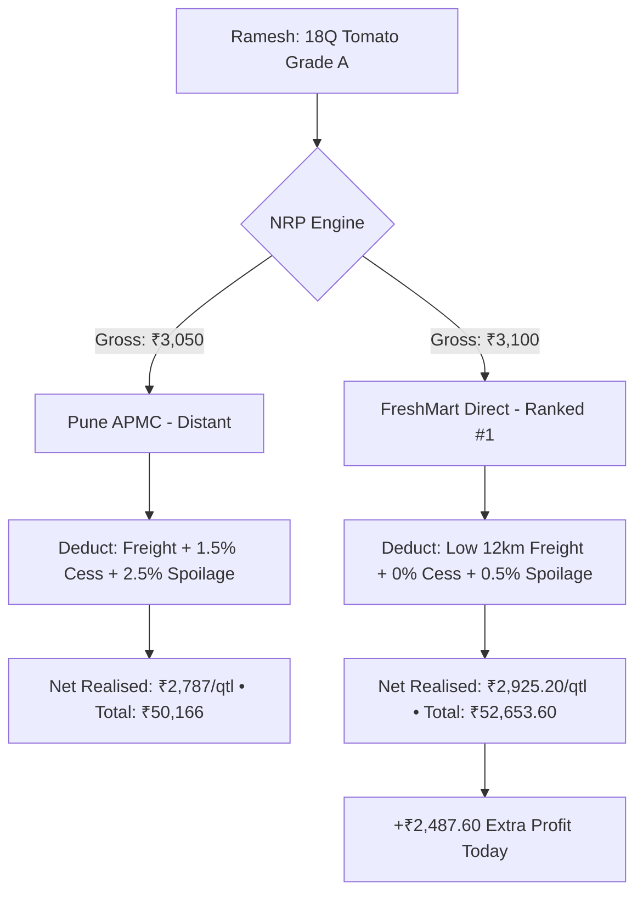

# Rama — Farmer & FPO Experience Guide
**Role:** Farmer & FPO Experience Lead  
**GitHub:** [`ramako7777-spec`](https://github.com/ramako7777-spec) • **Email:** `ramako7777@gmail.com`  
**Assigned Branch:** `feature/farmer-fpo` • **Team:** HackOps (SIH 2026)

---

## 1. Quick Summary (What I Built)
- **Farmer Command Center (`/dashboard`):** Real-time daily decision card showing the single best practical selling channel.
- **7-Channel Market Comparison (`/markets`):** Ranks traditional APMC mandis vs direct corporate processors by true **Net Realised Price (NRP)**.
- **Harvest Lot Manager (`/lots`):** Complete workflow for creating, grading, and tracking harvest lots.
- **FPO Collective Logistics Pooling (`/fpo`):** Aggregates fragmented smallholder lots to unlock institutional Minimum Order Quantities (MOQs like 50Q) and cut freight by 38%.
- **Canonical Scenario Verification:** Validated Ramesh Kumar's 18 Quintal Tomato Hybrid harvest.

---

## 2. In Simple Words (The Metaphor)
> **The Illusory Paycheck:** Imagine two jobs: Job A in Mumbai offers ₹50,000, but train tickets, rent, and local taxes cost ₹25,000 (Take-home = ₹25,000). Job B in your hometown offers ₹35,000, but travel and living costs are ₹0 (Take-home = ₹35,000). Job B puts ₹10,000 more cash into your pocket! In farming, Pune Mandi offers a deceptive ₹3,050 gross price, but freight and fees reduce it to ₹2,787 net. KrishiSetu connects Ramesh to FreshMart at ₹2,925.20 net, putting **₹2,487.60 extra cash in his pocket today**.

---

## 3. How It Works (Architecture & Diagram)

---

## 4. Technical Details & Code (From Beginner to Advanced)

### 🟢 Beginner: The Core Problem
- Farmers travel to distant mandis lured by high advertised rates, only to lose money to diesel, loading fees, mandi taxes, and transit spoilage.
- Small farmers cannot sell to high-paying buyers because they cannot meet high volume thresholds (e.g. 50 Quintals minimum).

### 🟡 Intermediate: Net Realised Price (NRP) Formula
$$\text{NRP} = \text{Gross Price} - \text{Freight Cost} - \text{Mandi Cess} - \text{Handling Fee} - \text{Spoilage Degradation}$$

- **FPO Collective Pooling:** Clusters Ramesh (18Q) + Suresh (20Q) + Ganesh (30Q) = 68Q total, unlocking AgriFresh's 50Q MOQ contract and replacing 3 small pickups with 1 shared truck.

### 🔴 Advanced: Perishability Spoilage Modeling
- The quality engine uses an exponential decay curve based on transit time and temperature:
  $$\text{Loss} = \text{Gross Value} \times \left(1 - e^{-k \cdot t \cdot (T / T_{\text{base}})}\right)$$
  *(where $k = 0.012$ for tomatoes, $t$ = transit hours, $T$ = temperature).*

### 📁 Key Files Owned
- [`apps/web/src/app/dashboard/page.tsx`](file:///c:/Users/kings/OneDrive/Desktop/SIH/apps/web/src/app/dashboard/page.tsx) — Farmer dashboard
- [`apps/web/src/app/markets/page.tsx`](file:///c:/Users/kings/OneDrive/Desktop/SIH/apps/web/src/app/markets/page.tsx) — 7-channel market comparison
- [`apps/web/src/app/fpo/page.tsx`](file:///c:/Users/kings/OneDrive/Desktop/SIH/apps/web/src/app/fpo/page.tsx) — FPO collective logistics pooling
- [`apps/web/src/app/lots/page.tsx`](file:///c:/Users/kings/OneDrive/Desktop/SIH/apps/web/src/app/lots/page.tsx) — Harvest lot management
- [`packages/shared/src/engines/nrp-engine.ts`](file:///c:/Users/kings/OneDrive/Desktop/SIH/packages/shared/src/engines/nrp-engine.ts) — Mathematical NRP calculation

---

## 5. Hackathon Viva & Defense (Top 5 Q&A)

**Q1: How do you present complex NRP numbers to an illiterate farmer?**  
> *"We avoid financial jargon. The UI uses a simple green comparison badge: '₹2,487 more cash in pocket compared to Pune Mandi'. The farmer sees the bottom-line take-home rupees directly."*

**Q2: What happens if one farmer leaves the FPO pool?**  
> *"Our aggregation engine creates pools with a volume buffer (e.g. 68Q pooled for a 50Q MOQ). If one farmer withdraws, automated notifications instantly alert nearby standby lots to maintain eligibility."*

**Q3: Why is selling to direct buyers better for perishable crops like tomatoes?**  
> *"Direct buyers like FreshMart operate local processing hubs 12 km away, cutting transit time from 3 hours to 35 minutes and reducing spoilage from 2.5% down to 0.5%."*

**Q4: Where do freight rates come from?**  
> *"Our logistics engine uses state LCV rates (₹15/km base rate plus fuel adjustments) and official MSAMB APMC cess schedules (1.0%–1.5%)."*

**Q5: How does this help achieve the national goal of doubling farmer income?**  
> *"By eliminating information asymmetry and unnecessary mandi middlemen, KrishiSetu recovers 12%–18% of harvest value that is normally lost to logistics inefficiencies and hidden deductions."*
