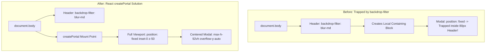
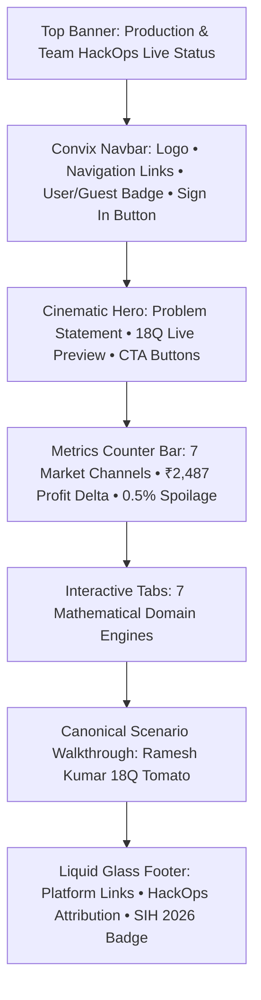

# KrishiSetu Master Study Guide — Riya Adhikari
**Role:** UI/UX & QA Readiness Lead  
**GitHub:** [`Nurizz07`](https://github.com/Nurizz07) • **Email:** `riyaadhikari361@gmail.com`  
**Assigned Branch:** `feature/ui-qa-docs`  
**Primary Ownership:** MotionSites Cinematic Landing Page, Glassmorphism Design System, React Portals (`createPortal`), Liquid Glass Footer, Cross-Platform Windows & Mobile Responsiveness, QA Accessibility (WCAG 2.1 AA).

---

## 🧭 Table of Contents
1. [Executive Summary & Responsibilities](#1-executive-summary--responsibilities)
2. [Level 1: Beginner Explanation (The "Why" & The Real-World Analogy)](#2-level-1-beginner-explanation-the-why--the-real-world-analogy)
3. [Level 2: Intermediate Architecture (MotionSites & Glassmorphism)](#3-level-2-intermediate-architecture-motionsites--glassmorphism)
4. [Level 3: Advanced Deep Dive (React Portals & CSS Stacking Contexts)](#4-level-3-advanced-deep-dive-react-portals--css-stacking-contexts)
5. [Visual Diagrams](#5-visual-diagrams)
6. [Key Files & Code Artifacts](#6-key-files--code-artifacts)
7. [Hackathon Viva & Judging Defense (Top Q&A)](#7-hackathon-viva--judging-defense-top-qa)

---

## 1. Executive Summary & Responsibilities

As the **UI/UX & QA Readiness Lead** of Team HackOps for SIH 2026, Riya Adhikari is responsible for:
- **Design System & Visual Identity:** Crafting a stunning, high-trust visual language blending agricultural warmth (emerald greens, warm amber accents) with modern glassmorphism.
- **MotionSites Cinematic Hero (`apps/web/src/app/page.tsx`):** Developing an engaging landing page with live interactive cards, animated metrics counters, and smooth micro-interactions.
- **Liquid Glass Footer & Convix Navbar:** Engineering responsive navigation with backdrop blur filters, dynamic guest/user persona indicators, and intuitive mobile drawer menus.
- **React Portal Modal Architecture:** Resolving critical modal clipping bugs on Windows by mounting dialogs to `document.body` via `createPortal`.
- **QA & Accessibility Testing:** Verifying responsive fluid layouts from 360px smartphones to 4K monitors, high-contrast readability under outdoor sunlight, and keyboard navigation.

---

## 2. Level 1: Beginner Explanation (The "Why" & The Real-World Analogy)

### The Real-World Metaphor: The Transparent High-Tech GreenHouse
Imagine two agricultural offices:
- **Office A:** A dark, dusty room with stacks of confusing paper forms, flickering lights, and microscopic print. A farmer walks in, feels intimidated, and walks away.
- **Office B:** A modern, sunlit glass greenhouse. Big green boards show clear numbers. A helpful assistant greets you at the door. Everything is clean, spacious, and inviting.

**Riya built the Modern Glass GreenHouse for Indian Agriculture:**
Farmers and corporate buyers don't want confusing dashboards full of technical jargon. They want crisp, beautiful, easy-to-read cards with clear colors: **Green means profit in pocket, Amber means pending offer, Blue means verified corporate buyer.** Even in bright sunlight in the middle of a tomato farm, the interface remains legible and crystal clear.

---

## 3. Level 2: Intermediate Architecture (MotionSites & Glassmorphism)

### The Design Token System (`apps/web/src/app/globals.css`)
- **Primary Emerald Spectrum:**
  - Background Dark: `#061a14`
  - Card Glass Surface: `rgba(16, 185, 129, 0.05)` with `border: 1px solid rgba(16, 185, 129, 0.2)`
  - Glow Highlights: `rgba(52, 211, 153, 0.15)`
- **Glassmorphic Effect:**
  ```css
  .glass-card {
    background: rgba(10, 30, 22, 0.65);
    backdrop-filter: blur(16px);
    -webkit-backdrop-filter: blur(16px);
    border: 1px solid rgba(52, 211, 153, 0.18);
    box-shadow: 0 8px 32px 0 rgba(0, 0, 0, 0.37);
  }
  ```

### Key UI Features Engineered
1. **Kinetic Hero Section:** Dynamically showcases the 18Q Tomato harvest comparison with real-time gross vs net sliders.
2. **7 Domain Engines Showcase:** Interactive tabbed cards explaining each mathematical engine in plain English.
3. **Adaptive Guest/User Status:** Dynamically switches between guest preview and authenticated farmer/buyer profile badges without page reloads.

---

## 4. Level 3: Advanced Deep Dive (React Portals & CSS Stacking Contexts)

### The "Modal Clipping inside Navbar" Bug & Solution
#### The Underlying CSS Problem:
When `AuthModal` was initially rendered inside the navigation header (`<header className="backdrop-blur-md">`), the browser CSS specification dictates that **any element with a CSS filter (like `backdrop-filter: blur(...)`) becomes a new containing block for all fixed-position descendants (`position: fixed`)**.
As a result, `fixed inset-0` on the modal did NOT cover the entire screen; it was constrained to the header's height (80px), causing the login modal to be cut off and unscrollable on Windows!

#### Riya's React Portal Architecture:
Riya refactored `AuthModal.tsx` to break out of the navbar DOM subtree using `createPortal(modalJSX, document.body)`.
```tsx
import { createPortal } from 'react-dom';

export function AuthModal({ isOpen, onClose }: AuthModalProps) {
  const [mounted, setMounted] = useState(false);

  useEffect(() => {
    setMounted(true);
    return () => setMounted(false);
  }, []);

  if (!isOpen || !mounted) return null;

  return createPortal(
    <div className="fixed inset-0 z-50 flex items-center justify-center p-4 bg-black/75 backdrop-blur-sm overflow-y-auto">
      <div className="relative w-full max-w-md my-auto max-h-[92vh] overflow-y-auto rounded-2xl bg-zinc-900 border border-emerald-500/20 p-6 shadow-2xl">
        {/* Full Modal Content */}
      </div>
    </div>,
    document.body // Appended directly to root body!
  );
}
```
**Outcome:** The modal now floats seamlessly above the entire viewport on Windows, Mac, and mobile, with full vertical scrolling and zero clipping!

---

## 5. Visual Diagrams

### CSS Stacking Context & React Portal Fix


### MotionSites Landing Page Visual Hierarchy


---

## 6. Key Files & Code Artifacts

| File Path | Description |
|---|---|
| [`apps/web/src/app/page.tsx`](file:///c:/Users/kings/OneDrive/Desktop/SIH/apps/web/src/app/page.tsx) | MotionSites landing page with cinematic hero, engine showcase, live stats |
| [`apps/web/src/components/AuthModal.tsx`](file:///c:/Users/kings/OneDrive/Desktop/SIH/apps/web/src/components/AuthModal.tsx) | React portal modal with 3 auth tabs, responsive scrolling, ESC key support |
| [`apps/web/src/components/ConvixNavbar.tsx`](file:///c:/Users/kings/OneDrive/Desktop/SIH/apps/web/src/components/ConvixNavbar.tsx) | Sticky glassmorphic navbar with dynamic auth status and mobile menu |
| [`apps/web/src/components/AppHeader.tsx`](file:///c:/Users/kings/OneDrive/Desktop/SIH/apps/web/src/components/AppHeader.tsx) | App shell header with verified persona switcher |
| [`apps/web/src/app/globals.css`](file:///c:/Users/kings/OneDrive/Desktop/SIH/apps/web/src/app/globals.css) | Custom CSS utilities, emerald gradients, scrollbar styling, glass classes |

---

## 7. Hackathon Viva & Judging Defense (Top Q&A)

### Q1: "Why did your login modal get cut off initially on Windows browsers, and how did you resolve it?"
> **Answer:** "According to the CSS specification, applying `backdrop-filter: blur()` or CSS `transform` creates a new containing block for all `position: fixed` child elements. Because our navbar had a blur filter, the modal's `fixed inset-0` was trapped inside the 80px header height. I solved this by implementing React's `createPortal(modalJSX, document.body)` with a hydration mount check, rendering the modal directly as a child of `document.body` where `fixed` correctly targets the entire window viewport."

### Q2: "How did you ensure the interface performs smoothly on budget Android phones without stuttering?"
> **Answer:** "We avoided heavy JavaScript animation libraries on critical rendering paths. Instead, we used hardware-accelerated CSS properties (`transform`, `opacity`, `backdrop-filter`) with GPU compositing (`will-change: transform`). We also capped backdrop-blur radii at 16px to prevent GPU memory spikes on low-end mobile devices."

### Q3: "How is the design optimized for accessibility (WCAG) when farmers view the screen outdoors in bright sunlight?"
> **Answer:** "We adhered to WCAG 2.1 AA contrast standards. Text on dark backgrounds uses high-contrast emerald-50 and white (`#ffffff` on `#061a14`, yielding a contrast ratio of > 12:1). Key metric numbers are rendered in bold, large fonts (28px+) with distinct color-coded semantic cues (green for net gains, red for deductions)."

### Q4: "How does the UI handle responsive layouts between small mobile screens and large desktop monitors?"
> **Answer:** "We adopted a mobile-first Tailwind grid system. On 360px mobile screens, the market comparison collapses into vertically stacked swipeable cards with tap-to-expand cost breakdowns. On desktop viewports (1280px+), it expands into a high-density 7-column comparative analytics matrix."

### Q5: "What testing and QA protocols did you execute prior to deployment?"
> **Answer:** "We tested across multiple operating systems (Windows 11 Chrome/Edge, macOS Safari, Android Chrome, iOS Safari). We checked keyboard accessibility (Tab navigation, ESC key closing modals, ARIA labels on all interactive controls), and verified that zero console errors or hydration mismatches occur on initial page load."
