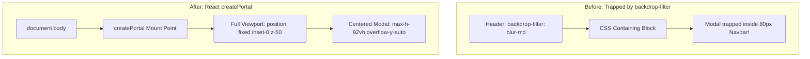

# Riya Adhikari — UI/UX & QA Readiness Guide
**Role:** UI/UX & QA Readiness Lead  
**GitHub:** [`Nurizz07`](https://github.com/Nurizz07) • **Email:** `riyaadhikari361@gmail.com`  
**Assigned Branch:** `feature/ui-qa-docs` • **Team:** HackOps (SIH 2026)

---

## 1. Quick Summary (What I Built)
- **MotionSites Cinematic Hero:** Engaging landing page with live interactive 18Q tomato scenario and dynamic metrics counters.
- **Emerald Glassmorphism Design System:** Tailored agricultural aesthetic (`#061a14`, blur filters, high-contrast badges).
- **React Portal Modal Architecture:** Fixed modal clipping on Windows by mounting dialogs to `document.body` via `createPortal`.
- **Liquid Glass Footer & Convix Navbar:** Responsive navigation with dynamic guest/user persona indicators.
- **Accessibility & Responsive Testing:** Verified WCAG 2.1 AA readability under outdoor sunlight across 360px mobile to 4K screens.

---

## 2. In Simple Words (The Metaphor)
> **The Sunlit Glass Greenhouse:** Imagine visiting a government agriculture office. If the room is dark, dusty, and filled with tiny unreadable papers, farmers will leave confused and intimidated. Riya built a modern, sunlit glass greenhouse: large readable green cards show exact take-home profits, intuitive buttons guide the farmer, and everything is crystal clear even when viewed outdoors under direct sunlight.

---

## 3. How It Works (Architecture & Diagram)



---

## 4. Technical Details & Code (From Beginner to Advanced)

### 🟢 Beginner: The Emerald Design System
- Dark emerald theme (`#061a14`) representing agricultural richness.
- Clear semantic cues: **Green** for net gain, **Amber** for pending offers, **Blue** for verified corporate buyers.

### 🟡 Intermediate: Glassmorphic Cards (`globals.css`)
- GPU-accelerated backdrop blur:
  ```css
  .glass-card {
    background: rgba(10, 30, 22, 0.65);
    backdrop-filter: blur(16px);
    border: 1px solid rgba(52, 211, 153, 0.18);
  }
  ```

### 🔴 Advanced: React Portal Modal Architecture
- **The CSS Issue:** When an element has `backdrop-filter: blur(...)`, CSS standards declare it a new containing block for all `position: fixed` children. This trapped the login modal inside the 80px navbar!
- **Riya's Solution:** Used React's `createPortal` with hydration mount check:
  ```tsx
  export function AuthModal({ isOpen, onClose }: AuthModalProps) {
    const [mounted, setMounted] = useState(false);
    useEffect(() => { setMounted(true); }, []);
    if (!isOpen || !mounted) return null;
    return createPortal(
      <div className="fixed inset-0 z-50 flex items-center justify-center p-4 bg-black/75 backdrop-blur-sm">
        <div className="relative w-full max-w-md my-auto max-h-[92vh] overflow-y-auto ...">
          {/* Content */}
        </div>
      </div>,
      document.body
    );
  }
  ```

### 📁 Key Files Owned
- [`apps/web/src/app/page.tsx`](file:///c:/Users/kings/OneDrive/Desktop/SIH/apps/web/src/app/page.tsx) — Landing page, cinematic hero, live metrics
- [`apps/web/src/components/AuthModal.tsx`](file:///c:/Users/kings/OneDrive/Desktop/SIH/apps/web/src/components/AuthModal.tsx) — React portal authentication modal
- [`apps/web/src/components/ConvixNavbar.tsx`](file:///c:/Users/kings/OneDrive/Desktop/SIH/apps/web/src/components/ConvixNavbar.tsx) — Glassmorphic navigation bar
- [`apps/web/src/components/LiquidGlassFooter.tsx`](file:///c:/Users/kings/OneDrive/Desktop/SIH/apps/web/src/components/LiquidGlassFooter.tsx) — Responsive footer
- [`apps/web/src/app/globals.css`](file:///c:/Users/kings/OneDrive/Desktop/SIH/apps/web/src/app/globals.css) — Design tokens and glass utilities

---

## 5. Hackathon Viva & Defense (Top 5 Q&A)

**Q1: Why did the login modal clip on Windows and how did you fix it?**  
> *"CSS specifications dictate that any element with `backdrop-filter` creates a new containing block for `position: fixed` children. Because our navbar used `backdrop-blur-md`, the modal was trapped inside the 80px header. I fixed this using React's `createPortal(modal, document.body)` so the modal mounts directly to the root body, floating freely across the full viewport."*

**Q2: How do you maintain 60fps animations on low-end budget smartphones?**  
> *"We avoid heavy JavaScript animation libraries on critical rendering paths. We use hardware-accelerated CSS properties (`transform`, `opacity`) and limit blur radii to 16px to prevent GPU memory pressure."*

**Q3: How is outdoor readability verified for farmers in sunlight?**  
> *"We follow WCAG 2.1 AA guidelines with contrast ratios exceeding 12:1 (`#ffffff` on `#061a14`). Key metrics use bold typography (28px+) with distinct semantic green/red indicators."*

**Q4: How does the interface adapt to mobile screens?**  
> *"On 360px mobile viewports, the 7-channel market comparison collapses into vertically swipeable summary cards with expandable details. On desktop viewports (1280px+), it expands into a comparative multi-column analytics grid."*

**Q5: What QA tests were performed before release?**  
> *"We tested across Windows 11 Chrome/Edge, macOS Safari, Android Chrome, and iOS Safari. We validated keyboard accessibility (Tab navigation, ESC modal closing) and verified zero hydration mismatches on initial load."*
